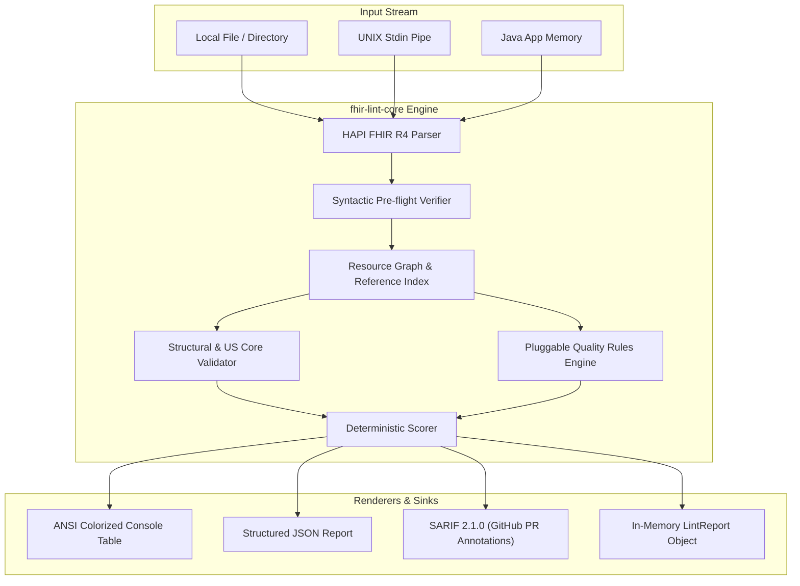

# Healthcare Data Quality Linter & Library

## 1. Project Overview

### Working name

**FHIRLint**

> A developer-focused command-line tool (CLI) and embeddable Java library that analyzes FHIR healthcare data and identifies interoperability, integrity, consistency, completeness, and terminology issues before the data reaches downstream applications.

### Problem

FHIR provides a standardized representation for healthcare data, but "valid FHIR" does not necessarily mean "good healthcare data."

Healthcare data can contain:

- Broken resource references
- Missing important information
- Invalid or inconsistent terminology
- Duplicate resources
- Conflicting information
- Inconsistent dates
- Resources that do not conform to an expected profile
- Missing relationships between resources
- Data that technically passes schema validation but is difficult or unsafe for downstream applications to use

FHIR Implementation Guides and profiles can impose additional constraints beyond the base FHIR specification. US Core, for example, defines additional constraints for U.S. healthcare interoperability. FHIR also supports `Must Support` requirements and implementation-specific profiles.

The project builds a standalone CLI tool and pure Java engine that goes beyond basic structural validation and provides **developer-oriented quality analysis** of a FHIR dataset—locally, instantly, and with zero external infrastructure.

### Core value proposition

Instead of:

> "Is this valid FHIR?"

FHIRLint answers:

> **"Can my application safely and reliably use this healthcare data, and what problems should I fix first?"**

---

# 2. Project Goals

## Primary goals

1. Accept FHIR resources and Bundles from local files, directories, or standard input (`stdin`).
2. Validate incoming data against the applicable FHIR specification/profile (e.g. US Core).
3. Analyze relationships and references between resources using an in-memory graph index.
4. Detect data-quality problems that basic schema validation does not catch (chronological contradictions, duplicate entities, missing clinical context).
5. Produce actionable issues with severity, FHIRPath location, explanation, and concrete remediation advice.
6. Calculate a deterministic overall quality score (0–100) and category-level breakdown.
7. Provide a high-performance, developer-friendly CLI with colorized ANSI tables, machine-readable JSON, and SARIF output for GitHub code scanning.
8. Support standard UNIX conventions (pipeable stdin, exit codes `0` for success and `1` for quality gate failure).
9. Provide an embeddable, framework-agnostic Java library API (`FhirLinter`) for direct integration into ETL and ingestion pipelines.
10. Operate with complete zero-retention privacy (in-memory processing, zero external databases, zero cloud hosting costs).

## Secondary goals (Out of scope for now)

Eventually support:

- Multiple FHIR versions (R4B, R5)
- Additional Implementation Guides/profiles
- User-defined custom quality rules via DSL or scripts
- Pre-commit git hook generators
- GraalVM Native Image compilation for single-file binary distribution
- Dataset comparison / diffing

---

# 3. Non-Goals

FHIRLint will NOT attempt to:

- Act as a hosted SaaS web application or remote cloud API
- Store or persist real patient data or raw FHIR payloads
- Replace a full EHR or clinical repository
- Provide clinical decision support
- Determine whether a medical treatment is clinically appropriate
- Make medical diagnoses
- Guarantee that healthcare data is medically correct
- Become a complete FHIR server
- Replace established FHIR conformance validators (it builds on top of HAPI FHIR)

The project is a **developer infrastructure and data-quality linter**, not a clinical product or cloud hosting service.

---

# 4. Target User

The primary user is a software engineer, data engineer, or integration specialist working with healthcare data.

Example:

> An engineering team receives a 20,000-resource FHIR Bundle from an external hospital system. Before loading it into their ingestion pipeline or database, they run `fhir-lint validate bundle.json` in their CI/CD workflow:

```text
Quality Score: 84/100 (ACCEPTABLE)

Resources analyzed: 20,143
Errors: 7 | Warnings: 43 | Informational: 91

Critical findings:
- 3 broken Patient references (Observation.subject -> Patient/999)
- 2 invalid terminology codes (Observation.code)
- 1 duplicate Patient (identical SSN identifier)
- 1 Encounter period inverted (end before start)

Category Breakdown:
- Referential Integrity: 98%
- Structural Conformance: 100%
- Profile Conformance:    92%
- Consistency:            96%
- Terminology:            94%
- Completeness:           91%
```

The CI build can automatically pass or fail based on `--min-score 80` or `--fail-on error`.

---

# 5. Core Concept: Quality Is More Than Validation

FHIRLint explicitly separates different categories of data quality.

## 5.1 Structural validity
Does the resource conform to the FHIR R4 schema structure (datatypes, cardinality, fields)? Leverages HAPI FHIR parser and validator.

## 5.2 Profile/conformance validation
Does the resource conform to the specified Implementation Guide (initial target: **FHIR R4 + US Core**)? Evaluates slices, invariants, and Must Support elements.

## 5.3 Referential integrity
Analyzes relationships across resources within the dataset.
- Target resource does not exist (broken local reference).
- Target resource type mismatch.
- Orphaned resources (observations without patient/encounter connections).

## 5.4 Data completeness
Identifies missing information that affects downstream usability (e.g. Observation missing subject or value/dataAbsentReason).

## 5.5 Terminology quality
Analyzes coded healthcare data (LOINC, SNOMED CT, RxNorm, ICD-10-CM, administrative gender). Checks for invalid code systems, missing systems, and invalid fixed value sets.

## 5.6 Cross-resource consistency
Identifies chronological inversions (encounter end before start, procedures before patient birth date) and status contradictions (diagnostic reports referencing entered-in-error observations).

## 5.7 Duplicate detection
Identifies resources that represent the same underlying entity (identical identifiers like SSN, or matching demographics).

---

# 6. Quality Model & Scoring Algorithm

The quality score is explicitly documented, deterministic, and reproducible.

### 6.1 Category Scoring Formula

For each category $c \in \{\text{structural}, \text{profileConformance}, \text{referentialIntegrity}, \text{consistency}, \text{terminology}, \text{completeness}\}$:

$$\text{DefectPenalty}_c = (N_{\text{error}, c} \times 15) + (N_{\text{warning}, c} \times 3) + (N_{\text{info}, c} \times 0)$$

$$\text{DensityFactor}_c = \frac{\text{DefectPenalty}_c}{\max(N_{\text{totalResources}}, 1) \times 15}$$

$$\text{CategoryScore}_c = \text{round}\Big(\max\big(0, 100 \times (1 - \min(1.0, \text{DensityFactor}_c))\big)\Big)$$

### 6.2 Overall Weighted Score

- **Referential Integrity**: 25% ($w = 0.25$)
- **Structural Conformance**: 20% ($w = 0.20$)
- **Profile Conformance**: 20% ($w = 0.20$)
- **Cross-Resource Consistency**: 15% ($w = 0.15$)
- **Terminology**: 10% ($w = 0.10$)
- **Completeness**: 10% ($w = 0.10$)

$$\text{OverallScore} = \text{round}\left( \sum_{c} w_c \cdot \text{CategoryScore}_c \right)$$

### 6.3 Engineering Grade Tiers

- **90–100**: `EXCELLENT` — High integrity, safe for automated ingestion.
- **75–89**: `ACCEPTABLE` — Minor non-critical warnings; downstream review recommended.
- **50–74**: `DEGRADED` — Contains broken references or chronological inconsistencies.
- **0–49**: `CRITICAL` — Severe structural or relational failures; ingestion should halt.

---

# 7. Issue Model

Every detected issue has a consistent, actionable structure:

```json
{
  "id": "issue_8f32",
  "severity": "ERROR",
  "category": "REFERENTIAL_INTEGRITY",
  "resourceType": "Observation",
  "resourceId": "obs-123",
  "path": "subject.reference",
  "message": "Referenced Patient/p-999 does not exist in dataset.",
  "ruleId": "REF-001",
  "suggestion": "Verify the Patient reference or include Patient/p-999 in the dataset."
}
```

---

# 8. User Interfaces: CLI & Java Library API

## 8.1 Command-Line Interface (CLI)

The CLI is the primary user-facing interface for terminal users and CI/CD pipelines.

### Usage
```bash
fhir-lint validate <file|directory|-> [options]
```

### Options
- `-p, --profile <NAME>`: Target validation profile (`BASE_R4`, `US_CORE`). Default: `US_CORE`.
- `-f, --format <FORMAT>`: Output format: `table` (default ANSI color table), `json`, `sarif`.
- `--min-score <0-100>`: Minimum passing score. Exits with code `1` if the overall score is below this threshold.
- `--fail-on <SEVERITY>`: Exit with code `1` if any issue of this severity or higher is detected (`error`, `warning`). Default: `error`.
- `-v, --verbose`: Display detailed issue listings in terminal table output.
- `-o, --output <PATH>`: Write output to a file instead of stdout.

### Exit Codes
- `0`: Quality check passed (score >= `--min-score` and no issues violating `--fail-on`).
- `1`: Quality check failed quality gate thresholds.
- `2`: Syntax or invocation error (malformed JSON, file not found, invalid flags).

### Example Terminal Invocations
```bash
# Validate a single bundle with default table output
fhir-lint validate sample-data/messy/messy-bundle.json

# Validate in CI with a score threshold and JSON output
fhir-lint validate bundle.json --format json --min-score 85

# Validate via UNIX pipe (stdin)
cat bundle.json | fhir-lint validate - --format table

# Generate SARIF for GitHub Code Scanning
fhir-lint validate bundle.json --format sarif -o results.sarif
```

---

## 8.2 Programmatic Java Library API

For Java applications and ingestion pipelines (Spring Batch, Apache Camel, Kafka consumers), `fhir-lint-core` provides a fluent in-memory API:

```java
import com.braeden.fhirlint.core.FhirLinter;
import com.braeden.fhirlint.core.model.LintReport;
import com.braeden.fhirlint.core.model.ValidationProfile;

// Initialize linter
FhirLinter linter = FhirLinter.create()
    .withProfile(ValidationProfile.US_CORE);

// Lint from file, string, or HAPI IBaseResource
LintReport report = linter.lint(new File("bundle.json"));

// Inspect results
int score = report.getQualityScore().getOverallScore();
if (report.hasErrors()) {
    report.getIssues().forEach(issue -> {
        System.err.println(issue.getRuleId() + ": " + issue.getMessage());
    });
}
```

---

# 9. Processing Architecture



---

# 10. Rule Engine Architecture

Quality rules are pluggable and implement a clean, framework-agnostic interface:

```java
public interface QualityRule {
    String getId();
    String getDescription();
    IssueCategory getCategory();
    Severity getSeverity();
    List<QualityIssue> evaluate(LintContext context);
}
```

### 10.1 MVP Rule Catalog

| Rule ID | Category | Severity | Applicable Types | Description |
| :--- | :--- | :--- | :--- | :--- |
| `REF-001` | `REFERENTIAL_INTEGRITY` | `ERROR` | Any with `Reference` | Target resource does not exist in the dataset (broken local/UUID reference). |
| `REF-002` | `REFERENTIAL_INTEGRITY` | `ERROR` | Any with `Reference` | Target resource type does not match field expectations. |
| `REF-003` | `REFERENTIAL_INTEGRITY` | `WARNING` | Observation, Condition | Resource is orphaned without connection to a Patient or Encounter. |
| `CONS-001`| `CONSISTENCY` | `ERROR` | Encounter, Coverage | Chronological inversion: `period.end` occurs before `period.start`. |
| `CONS-002`| `CONSISTENCY` | `ERROR` | MedicationRequest, Observation | Clinical event occurs prior to Patient's `birthDate`. |
| `CONS-003`| `CONSISTENCY` | `WARNING` | Observation, Procedure | Clinical event occurs after Patient's `deceasedDateTime`. |
| `CONS-004`| `CONSISTENCY` | `ERROR` | DiagnosticReport | Final report references an Observation that is `entered-in-error` or `cancelled`. |
| `DUP-001` | `DUPLICATE` | `ERROR` | Patient | Distinct Patient resources share identical identifier system and value (e.g., SSN). |
| `DUP-002` | `DUPLICATE` | `WARNING` | Patient | Distinct Patient resources match family name, given name, birthDate, and postal code. |
| `TERM-001`| `TERMINOLOGY` | `WARNING` | Coding | Coding system URI is invalid, misspelled, or uses non-canonical URL. |
| `TERM-002`| `TERMINOLOGY` | `ERROR` | Observation (Vital Signs) | Vital sign valueQuantity missing UCUM unit or system `http://unitsofmeasure.org`. |
| `TERM-003`| `TERMINOLOGY` | `ERROR` | Patient, Encounter | Code does not exist in required fixed ValueSet (e.g. AdministrativeGender). |
| `COMP-001`| `COMPLETENESS` | `ERROR` | Observation, Condition | Clinical resource missing required `subject` reference. |
| `COMP-002`| `COMPLETENESS` | `WARNING` | Observation | Observation has neither a `value[x]` nor a `dataAbsentReason`. |

---

# 11. Technology Stack

- **Language**: Java 21+
- **Healthcare Libraries**: HAPI FHIR (`hapi-fhir-base`, `hapi-fhir-structures-r4`)
- **CLI Framework**: Picocli (`info.picocli:picocli`)
- **JSON Processing**: Jackson (`jackson-databind`)
- **Logging**: SLF4J + Logback
- **Build Tool**: Gradle (with `application` and `java` plugins)
- **Testing**: JUnit 5, AssertJ
- **Distribution Options**: Runnable Fat JAR, GraalVM Native Image executable, GitHub Action

---

# 12. Repository Structure

```text
fhir-lint/
├── src/
│   ├── main/java/com/braeden/fhirlint/
│   │   ├── cli/                   # Picocli command-line app & output renderers
│   │   │   ├── FhirLintApplication.java
│   │   │   └── renderer/          # ANSI table, JSON, SARIF renderers
│   │   └── core/                  # Pure Java engine (zero framework dependencies)
│   │       ├── FhirLinter.java    # Fluent Java entry point
│   │       ├── parser/            # HAPI FHIR parser & Bundle unroller
│   │       ├── model/             # Issue, Score, Category, LintReport models
│   │       ├── graph/             # In-memory resource relationship index
│   │       ├── rules/             # Quality rules catalog
│   │       └── scoring/           # Deterministic quality scoring engine
│   └── test/java/com/braeden/fhirlint/
│       ├── cli/                   # CLI execution & output tests
│       └── core/                  # Core engine unit tests
├── sample-data/
│   ├── clean/clean-bundle.json
│   └── messy/messy-bundle.json
├── docs/
│   ├── adr/                       # Architecture Decision Records
│   └── research/                  # Technical research & findings
├── build.gradle
└── README.md
```

---

# 13. Development Phases

- **Phase 0 — Research & Architecture (Status: Completed)**
  - HAPI FHIR validation analysis, scoring model, synthetic datasets, and local-first architecture.
- **Phase 1 — Local Dataset Ingestion & Boundary Parsing (Status: In Progress)**
  - Local file and stdin parsing via HAPI FHIR R4, syntactic pre-flight boundary validation, and resource inventory metrics.
- **Phase 2 — Structural & Profile Validation**
  - Integrate HAPI FHIR baseline validator and US Core StructureDefinitions.
- **Phase 3 — Referential Integrity & Resource Graph**
  - Build in-memory resource relationship index; detect broken/missing references.
- **Phase 4 — Data Quality Rules**
  - Pluggable rule engine implementing the Phase 4 catalog (consistency, duplicates, completeness, terminology).
- **Phase 5 — Quality Scoring**
  - Deterministic multi-category scoring formula and engineering grade assignment.
- **Phase 6 — Developer Experience & CLI Outputs**
  - Polished Picocli interface, ANSI tables, JSON report, and SARIF output.
- **Phase 7 — Standalone Packaging & CI/CD Gates**
  - Fat JAR, GraalVM native binary compilation, and GitHub Action.
- **Phase 8 — Advanced Extensibility**
  - Custom rule definitions and dataset comparison.

---

# 18. Definition of MVP

The project is considered MVP-complete when a developer can:

1. Clone or download `fhir-lint`.
2. Run `fhir-lint validate sample-data/messy/messy-bundle.json` in their terminal.
3. Observe immediate, colorized terminal output with:
   - Overall Quality Score (e.g., `84/100 ACCEPTABLE`)
   - Category breakdowns
   - Actionable list of errors and warnings with FHIRPath locations and suggestions.
4. Pass `--format json` or `--format sarif` to pipe or record structured outputs.
5. Provide `--min-score 90` to observe exit code `1` on a degraded dataset and `0` on `clean-bundle.json`.
6. Embed `FhirLinter.create().lint(...)` as a Java dependency in code with zero external services or databases required.
7. Run the comprehensive automated test suite in under 3 seconds.

---

# Technology Decision Summary

| Area | Decision | Rationale |
| :--- | :--- | :--- |
| **Language** | Java 21+ | Best-in-class HAPI FHIR ecosystem, strong typing, high performance |
| **Interface** | CLI (Picocli) & Java Library | Zero infrastructure cost, local-first privacy, direct CI/CD integration |
| **FHIR Library** | HAPI FHIR R4 | Reference HL7 implementation, official R4 & US Core support |
| **Data Storage** | None (Stateless In-Memory) | Zero retention, HIPAA compliant, zero database overhead |
| **Outputs** | ANSI Table, JSON, SARIF | Standard developer ergonomics, pipeable, GitHub Code Scanning native |
| **Build Tool** | Gradle | Standard Java build automation |
| **Packaging** | Fat JAR / Native Binary / GitHub Action | Portable execution on any platform |
