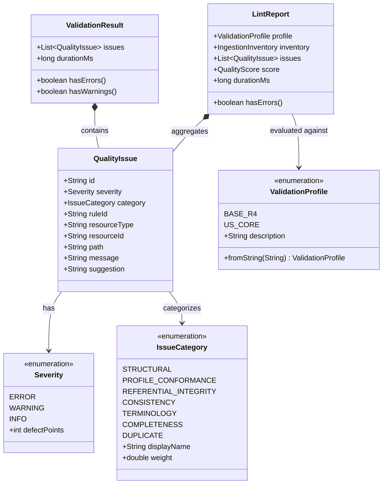
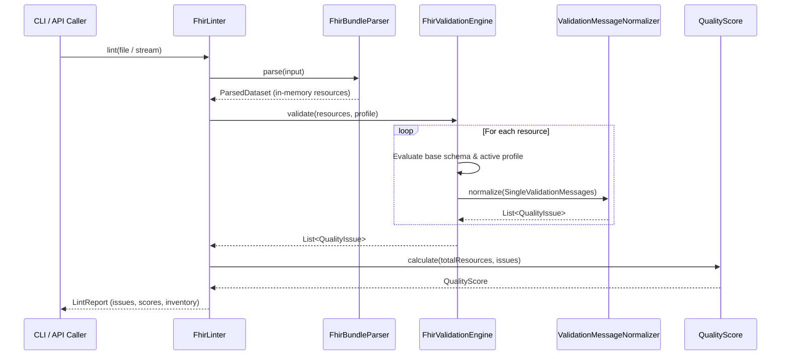

# Phase 1: Data Model & Entity Specifications

This document defines the core data model, entity structures, field types, relationships, and validation rules for **Phase 2: Structural and Profile Validation**.

---

## 1. Domain Entities & Value Objects



---

## 2. Entity Details

### 2.1 `ValidationProfile` (Enumeration)
Defines the target validation conformance level applied during dataset evaluation.

| Value | Description | Conformance Rules Applied |
| :--- | :--- | :--- |
| `BASE_R4` | HL7 FHIR R4 Base Specification | Core schema only (primitive regexes, datatypes, required base elements, unrecognized fields). |
| `US_CORE` | US Core Implementation Guide (v3.1.1) | Core schema PLUS official US Core profiles (mandatory extensions, slices, Must Support elements, invariants). Default. |

*Note on Parsing*: `ValidationProfile.fromString(String)` must strictly validate input. Passing an unrecognized profile string throws `IllegalArgumentException`, enabling the CLI layer to report exit code `2`.

### 2.2 `QualityIssue` (Record)
A standardized, developer-facing finding generated during structural or profile validation.

| Field | Type | Required | Description | Example |
| :--- | :--- | :---: | :--- | :--- |
| `id` | `String` | Yes | Unique issue identifier (`issue_<short-uuid>`). | `"issue_8f32a10c"` |
| `severity` | `Severity` | Yes | Issue impact level (`ERROR`, `WARNING`, `INFO`). | `Severity.ERROR` |
| `category` | `IssueCategory` | Yes | Defect classification (`STRUCTURAL` or `PROFILE_CONFORMANCE`). | `IssueCategory.STRUCTURAL` |
| `ruleId` | `String` | Yes | Stable rule or error identifier for programmatic filtering. | `"STRUCT-001"`, `"USCORE-PAT-01"` |
| `resourceType` | `String` | No | FHIR resource type where the defect was found. | `"Patient"` |
| `resourceId` | `String` | No | ID of the resource where the defect was found. | `"pat-123"` |
| `path` | `String` | No | FHIRPath or field location of the invalid element. | `"Patient.birthDate"` |
| `message` | `String` | Yes | Human-readable explanation of the defect. | `"Invalid primitive format: '1980-99-99' does not match FHIR date regex."` |
| `suggestion` | `String` | No | Concrete remediation guidance to fix the defect. | `"Provide a valid ISO date in YYYY-MM-DD format."` |

### 2.3 `Severity` (Enumeration)
Classification of defect severity.

| Severity | Penalty Points in Quality Score | CLI Exit Impact (Default `--fail-on error`) |
| :--- | :---: | :--- |
| `ERROR` | 15 | Causes non-zero exit code (code 1) |
| `WARNING` | 3 | Informs review; causes exit code 1 if `--fail-on warning` |
| `INFO` | 0 | Non-blocking diagnostic guidance |

### 2.4 `ValidationResult` (Internal Value Object)
Represents the outcome of a validation engine pass on an individual resource or dataset.

| Field | Type | Description |
| :--- | :--- | :--- |
| `issues` | `List<QualityIssue>` | List of normalized issues identified during the validation pass. |
| `durationMs` | `long` | Execution duration in milliseconds. |

### 2.5 Deterministic Rule ID Catalog
Structural and profile conformance issues map deterministically to stable rule IDs:

| Rule ID | Category | Severity | Description |
| :--- | :--- | :--- | :--- |
| `STRUCT_PRIMITIVE_FORMAT` | `STRUCTURAL` | `ERROR` | Invalid primitive syntax (e.g. invalid date or regex violation). |
| `STRUCT_DATATYPE` | `STRUCTURAL` | `ERROR` | Field value type does not match FHIR R4 schema definition. |
| `STRUCT_CARDINALITY` | `STRUCTURAL` | `ERROR` | Missing mandatory base element or array count out of bounds. |
| `STRUCT_UNKNOWN_ELEMENT` | `STRUCTURAL` | `ERROR` | Element present in JSON payload not defined in FHIR R4 specification. |
| `USCORE_MANDATORY_FIELD` | `PROFILE_CONFORMANCE` | `ERROR` | Resource missing mandatory element required by US Core profile. |
| `USCORE_INVARIANT` | `PROFILE_CONFORMANCE` | `ERROR` | Failure of US Core FHIRPath invariant (e.g. `us-core-8`). |
| `USCORE_SLICING` | `PROFILE_CONFORMANCE` | `ERROR` | Array elements violate profile slicing rules or missing required slice. |
| `USCORE_MUST_SUPPORT` | `PROFILE_CONFORMANCE` | `WARNING` | Must Support element missing or incomplete. |

---

## 3. Mapping and Classification Rules

### 3.1 Severity Mapping from HAPI FHIR

```text
HAPI ResultSeverityEnum.FATAL        ───► Severity.ERROR
HAPI ResultSeverityEnum.ERROR        ───► Severity.ERROR
HAPI ResultSeverityEnum.WARNING      ───► Severity.WARNING
HAPI ResultSeverityEnum.INFORMATION  ───► Severity.INFO
```

### 3.2 Category Classification

```text
Is issue from base R4 StructureDefinition / schema?
  ├─► YES (e.g., regex, unknown element, base cardinality) ──► IssueCategory.STRUCTURAL
  └─► NO (e.g., US Core profile URL, slice, invariant)    ──► IssueCategory.PROFILE_CONFORMANCE
```

---

## 4. State Lifecycle and Processing Flow


