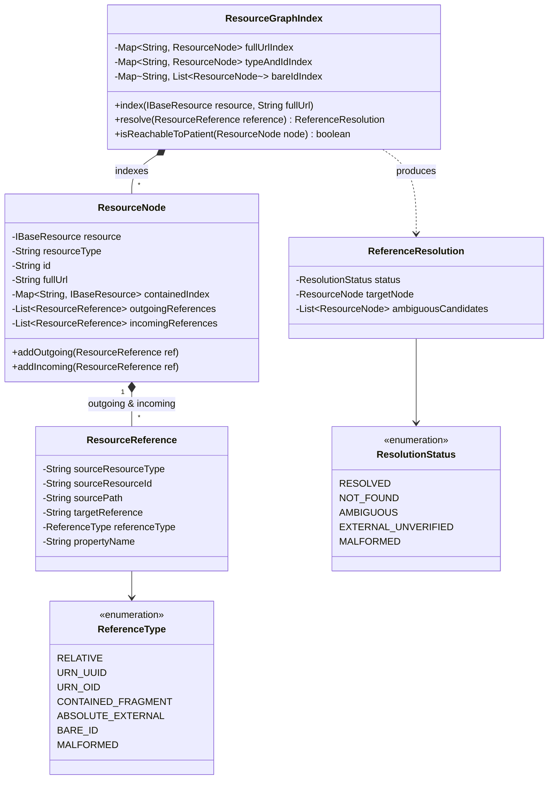

# Data Model: Phase 3 — Referential Integrity and Resource Graph

## Core Entities & Models

The referential integrity subsystem operates strictly in-memory using lightweight Java models and collections, mapping relationships across ingested FHIR R4 resources without database persistence.



---

## Entity Definitions

### 1. `ResourceNode`
Represents an individual FHIR resource within the in-memory relationship graph.

- **Package**: `org.fhirlint.core.graph`
- **Fields**:
  - `resource`: `org.hl7.fhir.instance.model.api.IBaseResource` — The parsed HAPI FHIR R4 resource instance.
  - `resourceType`: `String` — FHIR resource type name (e.g. `Patient`, `Observation`, `Encounter`).
  - `id`: `String` — Logical resource identifier (`resource.getIdElement().getIdPart()`), or generated/null if absent.
  - `fullUrl`: `String` — Full URL from bundle entry (e.g. `urn:uuid:...` or `http://...`), if provided.
  - `containedIndex`: `Map<String, IBaseResource>` — Local index mapping `#id` fragments to embedded contained resources.
  - `outgoingReferences`: `List<ResourceReference>` — References originating from this resource pointing to other resources.
  - `incomingReferences`: `List<ResourceReference>` — References originating from other resources pointing to this node.

### 2. `ResourceReference`
Represents a directed reference extracted from a source resource field.

- **Package**: `org.fhirlint.core.graph`
- **Fields**:
  - `sourceResourceType`: `String` — Resource type of the enclosing source resource.
  - `sourceResourceId`: `String` — ID of the enclosing source resource.
  - `sourcePath`: `String` — Exact FHIRPath to the reference element (e.g. `Observation.subject.reference`).
  - `targetReference`: `String` — Raw value of `Reference.reference`.
  - `referenceType`: `ReferenceType` — Classified reference format.
  - `propertyName`: `String` — Enclosing property name (e.g. `subject`, `encounter`, `hasMember`) used to query schema-allowed types.

### 3. `ReferenceType` (Enum)
Classifies the format and resolution strategy for a reference string.

- `RELATIVE`: Standard `<ResourceType>/<id>` (e.g. `Patient/pat-123`).
- `URN_UUID`: UUID URN scheme (e.g. `urn:uuid:7b420ee9-4c8d-4f15-99d8-111111111111`).
- `URN_OID`: OID URN scheme (e.g. `urn:oid:2.16.840.1.113883.4.1`).
- `CONTAINED_FRAGMENT`: Internal fragment (e.g. `#inline-org`).
- `ABSOLUTE_EXTERNAL`: Absolute HTTP/HTTPS URL outside local bundle identity (e.g. `https://hospital.org/fhir/Patient/1`).
- `BARE_ID`: Unqualified ID without resource type prefix (e.g. `12345`).
- `MALFORMED`: Empty, whitespace, or unparseable reference string.

### 4. `ResourceGraphIndex`
The dataset-level relationship graph index.

- **Package**: `org.fhirlint.core.graph`
- **Internal State**:
  - `fullUrlIndex`: `Map<String, ResourceNode>` — Matches exact `fullUrl` values and canonical absolute URLs.
  - `typeAndIdIndex`: `Map<String, ResourceNode>` — Matches `${resourceType}/${id}` keys.
  - `bareIdIndex`: `Map<String, List<ResourceNode>>` — Matches standalone `${id}` to detect disambiguation collisions.
- **Key Operations**:
  - `indexResource(IBaseResource resource, String fullUrl)`: Indexes a node into all lookup tables.
  - `resolve(ResourceReference ref)`: Determines the target `ResourceNode` in $O(1)$ time.
  - `isReachableToPatient(ResourceNode node)`: Performs BFS cycle-safe traversal to verify patient context reachability.

---

## Referential Integrity Rule Mapping

| Rule ID | Name | Category | Severity | Detection Trigger |
| :--- | :--- | :--- | :---: | :--- |
| `REF-001` | Broken Local Reference | `REFERENTIAL_INTEGRITY` | `ERROR` | Target does not exist in dataset for relative path, UUID URN, broken `#contained` fragment, ambiguous bare ID, or empty reference. |
| `REF-002` | Reference Type Mismatch | `REFERENTIAL_INTEGRITY` | `ERROR` | Target resource exists, but its `ResourceType` is not permitted by FHIR R4 schema for that source property. |
| `REF-003` | Orphaned Clinical Resource | `REFERENTIAL_INTEGRITY` | `WARNING` | An `Observation`, `Condition`, or `DiagnosticReport` lacks any direct or indirect path to a `Patient` node. |
| `REF-004` | Unverified External Reference | `REFERENTIAL_INTEGRITY` | `INFO` | Reference points to an external absolute HTTP/HTTPS URI outside the dataset boundary during offline analysis. |

---

## Diagnostic Output Model

Findings integrate directly into the existing `QualityIssue` record:

```json
{
  "id": "issue_c18a24b1",
  "severity": "ERROR",
  "category": "REFERENTIAL_INTEGRITY",
  "ruleId": "REF-001",
  "resourceType": "Observation",
  "resourceId": "obs-123",
  "path": "Observation.subject.reference",
  "message": "Referenced target 'Patient/pat-missing' does not exist in the dataset.",
  "suggestion": "Verify that the referenced Patient resource is included in the bundle or update the reference ID."
}
```
