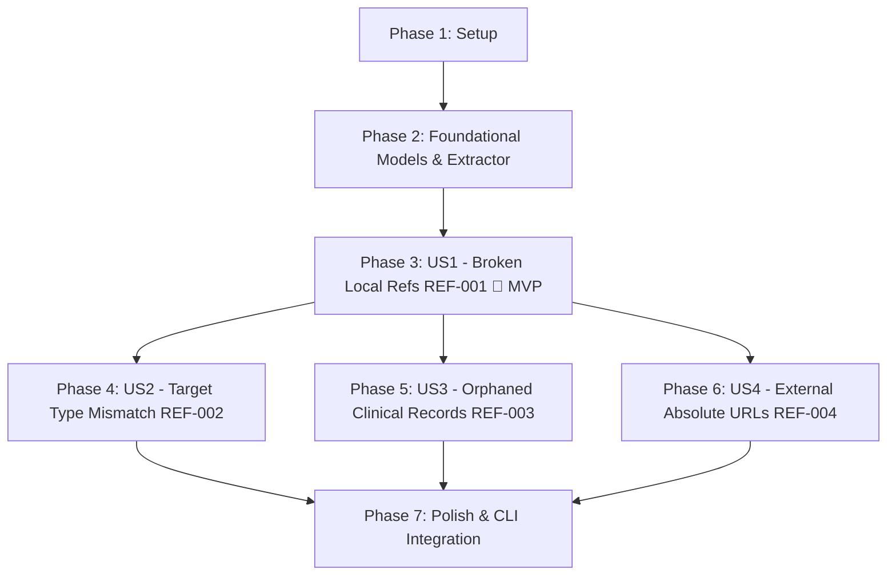

# Tasks: Phase 3 — Referential Integrity and Resource Graph

**Feature Branch**: `003-referential-integrity-graph`  
**Implementation Plan**: [plan.md](plan.md)  
**Feature Spec**: [spec.md](spec.md)  
**Data Model**: [data-model.md](data-model.md)  
**Quickstart**: [quickstart.md](quickstart.md)  

---

## Phase 1: Setup (Shared Infrastructure)

**Purpose**: Initialize synthetic test data fixtures and infrastructure for referential integrity evaluation.

- [X] T001 [P] Create synthetic broken local reference and UUID test fixture in `sample-data/referential/broken-reference.json`
- [X] T002 [P] Create synthetic reference target type mismatch test fixture in `sample-data/referential/type-mismatch.json`
- [X] T003 [P] Create synthetic orphaned clinical resource test fixture in `sample-data/referential/orphaned-observation.json`
- [X] T004 [P] Create synthetic external absolute HTTP/HTTPS reference test fixture in `sample-data/referential/external-reference.json`
- [X] T005 [P] Create synthetic contained resource fragment test fixture in `sample-data/referential/contained-reference.json`
- [X] T006 [P] Create synthetic multi-file dataset test directory with cross-file references in `sample-data/referential/multi-file/patient.json` and `sample-data/referential/multi-file/observation.json`

---

## Phase 2: Foundational (Blocking Prerequisites)

**Purpose**: Core data models, extraction visitor, and in-memory graph index structure that MUST be complete before user story implementation begins.

**⚠️ CRITICAL**: No user story work can begin until this phase is complete.

- [X] T007 [P] Create `ReferenceType` enum in `src/main/java/org/fhirlint/core/graph/ReferenceType.java` with values `RELATIVE`, `URN_UUID`, `URN_OID`, `CONTAINED_FRAGMENT`, `ABSOLUTE_EXTERNAL`, `BARE_ID`, and `MALFORMED`
- [X] T008 [P] Create `ResolutionStatus` enum in `src/main/java/org/fhirlint/core/graph/ResolutionStatus.java` with values `RESOLVED`, `NOT_FOUND`, `AMBIGUOUS`, `EXTERNAL_UNVERIFIED`, and `MALFORMED`
- [X] T009 [P] Create `ResourceReference` record in `src/main/java/org/fhirlint/core/graph/ResourceReference.java` containing `String sourceResourceType`, `String sourceResourceId`, `String sourcePath`, `String targetReference`, `ReferenceType referenceType`, and `String propertyName`
- [X] T010 [P] Create `ReferenceResolution` record in `src/main/java/org/fhirlint/core/graph/ReferenceResolution.java` containing `ResolutionStatus status`, `ResourceNode targetNode`, and `List<ResourceNode> ambiguousCandidates`
- [X] T011 Create `ResourceNode` class in `src/main/java/org/fhirlint/core/graph/ResourceNode.java` holding `IBaseResource resource`, `String resourceType`, `String id`, `String fullUrl`, `Map<String, IBaseResource> containedIndex`, `List<ResourceReference> outgoingReferences`, and `List<ResourceReference> incomingReferences`
- [X] T012 Implement `ReferenceExtractor` in `src/main/java/org/fhirlint/core/graph/ReferenceExtractor.java` using recursive `Base.children()` AST traversal to discover all `Reference` elements with exact FHIRPaths and property names
- [X] T013 Implement `ResourceGraphIndex` in `src/main/java/org/fhirlint/core/graph/ResourceGraphIndex.java` managing `fullUrlIndex` (`Map<String, ResourceNode>`), `typeAndIdIndex` (`Map<String, ResourceNode>`), and `bareIdIndex` (`Map<String, List<ResourceNode>>`)
- [X] T014 Create `ReferentialIntegrityEngine` interface in `src/main/java/org/fhirlint/core/graph/ReferentialIntegrityEngine.java` defining `analyze(List<IBaseResource>)`, `analyze(Bundle)`, and `buildIndex(List<IBaseResource>)`

**Checkpoint**: Foundation ready — user story implementation can now begin.

---

## Phase 3: User Story 1 - Detection of Broken and Dangling Local References (Priority: P1) 🎯 MVP

**Goal**: Resolve relative references (`<type>/<id>`), UUID URNs (`urn:uuid:...`), `#contained` fragments, and bare IDs against dataset resources, reporting missing/empty targets under `REF-001` (`ERROR`).

**Independent Test**: Submit datasets with broken relative links, nonexistent UUID URNs, missing `#contained` fragments, and empty references; verify `REF-001` error issues with exact FHIRPaths and remediation advice.

### Tests for User Story 1

> **NOTE: Write these tests FIRST, ensure they FAIL before implementation**

- [X] T015 [P] [US1] Unit and integration tests for local reference resolution and `REF-001` broken reference detection in `src/test/java/org/fhirlint/core/graph/BrokenReferenceDetectionTest.java`

### Implementation for User Story 1

- [X] T016 [US1] Implement reference indexing and resolution logic in `src/main/java/org/fhirlint/core/graph/ResourceGraphIndex.java` matching relative `Type/id`, `urn:uuid:`, `#contained` fragments, and bare IDs
- [X] T017 [US1] Implement broken reference analysis and `REF-001` error issue generation in `src/main/java/org/fhirlint/core/graph/DefaultReferentialIntegrityEngine.java` for unresolvable targets, broken contained fragments, bare ID collisions, and empty/whitespace references
- [X] T018 [US1] Update `FhirLinter.java` in `src/main/java/org/fhirlint/core/FhirLinter.java` (`lint(List<File> files)`) to aggregate all parsed resources across batch files into a unified dataset before constructing `ResourceGraphIndex`
- [X] T019 [US1] Integrate `ReferentialIntegrityEngine` execution into `FhirLinter.java` in `src/main/java/org/fhirlint/core/FhirLinter.java` (`evaluate()` and `lint(List<File>)`) to collect `QualityIssue` findings

**Checkpoint**: User Story 1 is fully functional and testable independently (Referential Integrity MVP).

---

## Phase 4: User Story 2 - Detection of Reference Target Type Mismatches (Priority: P2)

**Goal**: Verify that resolved reference targets match permitted resource types defined in the HL7 FHIR R4 schema for the referencing property, emitting `REF-002` (`ERROR`) on mismatches.

**Independent Test**: Submit a dataset where an `Observation.subject` references an existing `Condition` or `MedicationRequest`; verify `REF-002` error specifying expected vs actual target types.

### Tests for User Story 2

- [X] T020 [P] [US2] Unit tests for reference target type mismatch validation in `src/test/java/org/fhirlint/core/graph/ReferenceTypeMismatchTest.java`

### Implementation for User Story 2

- [X] T021 [US2] Implement schema permitted target type lookup using HAPI `RuntimeResourceDefinition` and runtime property definitions in `src/main/java/org/fhirlint/core/graph/DefaultReferentialIntegrityEngine.java`
- [X] T022 [US2] Implement `REF-002` error issue generation in `src/main/java/org/fhirlint/core/graph/DefaultReferentialIntegrityEngine.java` specifying the offending path, actual target type, expected target types, and remediation guidance

**Checkpoint**: User Stories 1 and 2 are functional independently and combined.

---

## Phase 5: User Story 3 - Detection of Orphaned and Context-Isolated Clinical Resources (Priority: P3)

**Goal**: Identify clinical resources strictly bounded to `Observation`, `Condition`, and `DiagnosticReport` that lack direct or indirect graph reachability to a root `Patient`, emitting `REF-003` (`WARNING`).

**Independent Test**: Submit an unlinked `Observation` with no references or incoming links to any `Patient`; verify `REF-003` warning issue is emitted. Verify that observations linked to a `Patient` via an `Encounter` or parent `DiagnosticReport` emit zero warnings.

### Tests for User Story 3

- [X] T023 [P] [US3] Unit and graph traversal tests for orphaned clinical context detection in `src/test/java/org/fhirlint/core/graph/TopologicalContextAnalysisTest.java`

### Implementation for User Story 3

- [X] T024 [US3] Implement cycle-safe BFS reachability traversal in `src/main/java/org/fhirlint/core/graph/ResourceGraphIndex.java` evaluating directed paths from candidate nodes to root `Patient` nodes
- [X] T025 [US3] Implement `REF-003` orphan detection analysis and warning issue generation in `src/main/java/org/fhirlint/core/graph/DefaultReferentialIntegrityEngine.java` for unlinked `Observation`, `Condition`, and `DiagnosticReport` resources

**Checkpoint**: User Stories 1, 2, and 3 work independently and combined.

---

## Phase 6: User Story 4 - Differentiated Handling of External and Absolute URI References (Priority: P4)

**Goal**: Differentiate external absolute HTTP/HTTPS references outside the local dataset perimeter from internal references, emitting `REF-004` (`INFO`) without blocking quality gates during standard offline linting.

**Independent Test**: Submit a dataset containing valid external HTTP/HTTPS references (`https://terminology.hl7.org/...` or external hospital endpoint); verify zero `REF-001` errors and confirm `REF-004` is reported as informational.

### Tests for User Story 4

- [X] T026 [P] [US4] Unit tests for external absolute URI classification and `REF-004` reporting in `src/test/java/org/fhirlint/core/graph/ExternalReferenceHandlingTest.java`

### Implementation for User Story 4

- [X] T027 [US4] Implement absolute external URL classification against bundle base URL and `fullUrl` entries in `src/main/java/org/fhirlint/core/graph/ResourceGraphIndex.java`
- [X] T028 [US4] Implement `REF-004` informational issue generation in `src/main/java/org/fhirlint/core/graph/DefaultReferentialIntegrityEngine.java` for external unverified references

**Checkpoint**: All 4 user stories are functional and verified.

---

## Phase 7: Polish & Cross-Cutting Concerns

**Purpose**: Reporting, CLI rendering, performance verification, and end-to-end integration across all user stories.

- [X] T029 Update `QualityScore.java` in `src/main/java/org/fhirlint/core/model/QualityScore.java` to verify `REFERENTIAL_INTEGRITY` category weight (25%) and score calculations with new rule IDs
- [X] T030 [P] Update `ConsoleTableRenderer.java` in `src/main/java/org/fhirlint/cli/renderer/ConsoleTableRenderer.java` to render the `Referential Integrity` category score row and formatted `REF-001` through `REF-004` issue details
- [X] T031 [P] Update `SarifReportRenderer.java` in `src/main/java/org/fhirlint/cli/renderer/SarifReportRenderer.java` to register rules `REF-001`, `REF-002`, `REF-003`, and `REF-004` in the SARIF driver rule table
- [X] T032 End-to-end CLI integration test in `src/test/java/org/fhirlint/cli/ReferentialIntegrityCliTest.java` verifying CLI exit codes (0 for pass/info, 1 for referential errors, 2 for syntax) and table/JSON/SARIF outputs
- [X] T033 Performance and memory benchmark test in `src/test/java/org/fhirlint/core/graph/GraphPerformanceTest.java` verifying indexing and analysis of 5,000 resources and 20,000 references in < 1.0s and < 64 MB working memory
- [X] T034 Execute end-to-end verification scenarios from `specs/003-referential-integrity-graph/quickstart.md` using Gradle runner

---

## Dependencies & Execution Order

### Phase Dependencies

- **Setup (Phase 1)**: No dependencies — can start immediately.
- **Foundational (Phase 2)**: Depends on Setup completion — BLOCKS all user stories.
- **User Stories (Phase 3+)**: All depend on Foundational phase completion.
  - User Story 1 (P1): Can start immediately after Foundational.
  - User Story 2 (P2): Depends on Foundational and builds on graph index from US1.
  - User Story 3 (P3): Depends on Foundational and uses graph adjacency from US1.
  - User Story 4 (P4): Depends on Foundational and reference classification from US1.
- **Polish (Phase 7)**: Depends on all user stories (Phase 3–6) being complete.

### User Story Dependencies

### Parallel Opportunities

- **Phase 1 (Setup)**: Tasks T001, T002, T003, T004, T005, T006 are all independent test data fixture creations and can run in parallel.
- **Phase 2 (Foundational)**: Tasks T007, T008, T009, T010 can run in parallel (independent enums and records).
- **User Stories (Phases 3–6)**: Tests for each story (T015, T020, T023, T026) can be authored in parallel once Foundational models are compiled.
- **Phase 7 (Polish)**: Renderers T030 and T031 can be updated in parallel.

---

## Implementation Strategy

### MVP First (User Story 1 Only)

1. Complete Phase 1: Setup (test fixtures T001–T006).
2. Complete Phase 2: Foundational (models, extractor, graph index T007–T014).
3. Complete Phase 3: User Story 1 (tests T015, implementation T016–T019).
4. **STOP and VALIDATE**: Run `BrokenReferenceDetectionTest` and verify `REF-001` broken reference detection works independently.
5. Deliver MVP slice!

### Incremental Delivery

1. Add User Story 2 (Type Mismatches `REF-002`) $\to$ validate via `ReferenceTypeMismatchTest`.
2. Add User Story 3 (Orphan Detection `REF-003`) $\to$ validate via `TopologicalContextAnalysisTest`.
3. Add User Story 4 (External References `REF-004`) $\to$ validate via `ExternalReferenceHandlingTest`.
4. Polish CLI renderers, run performance benchmarks, and validate `quickstart.md` scenarios.
