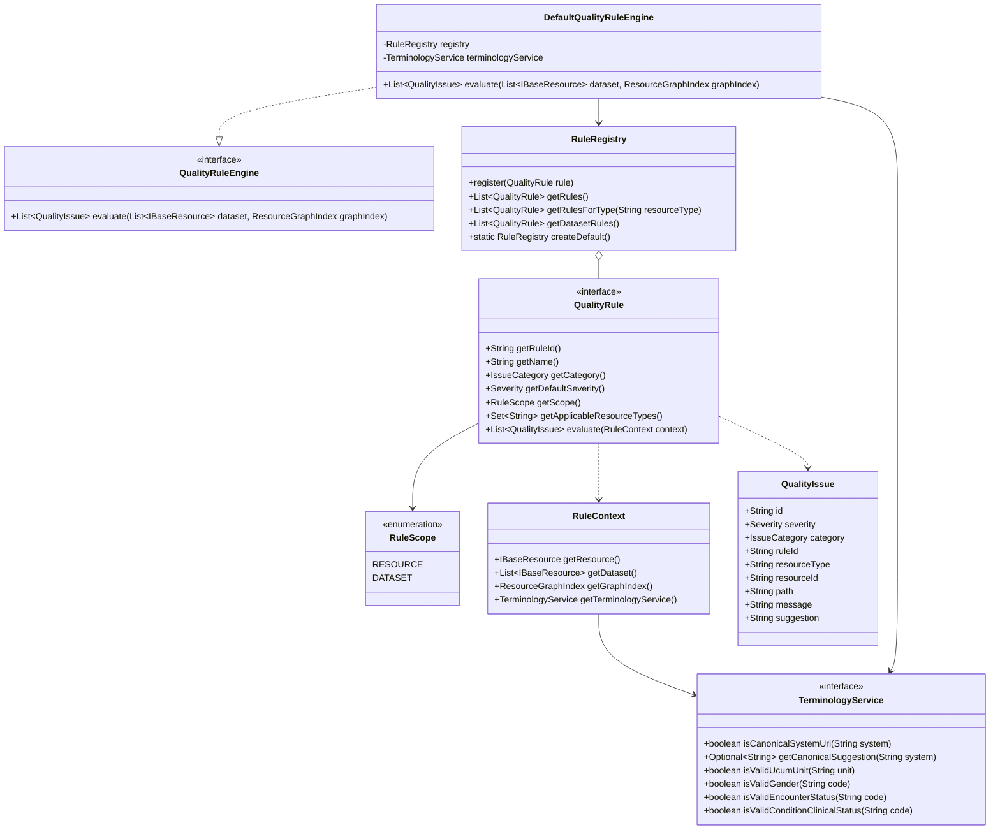
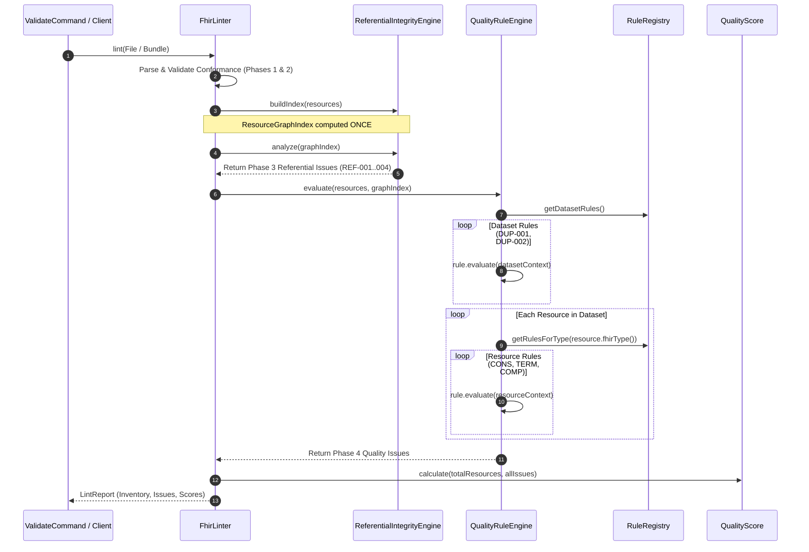

# Data Model: Phase 4 — Pluggable Rule Engine and Data-Quality Checks

**Feature Branch**: `004-rule-engine-data-quality` | **Date**: 2026-09-27  
**Specification**: [`specs/004-rule-engine-data-quality/spec.md`](spec.md)

---

## 1. Domain Entities & Interfaces

---

## 2. Entity Specifications

### 2.1 `QualityRule` (Interface)
- **Package**: `org.fhirlint.core.rules`
- **Role**: Base contract for all pluggable quality validation rules.
- **Attributes / Methods**:
  - `getRuleId()`: Unique rule identifier (`CONS-001`, `DUP-001`, etc.).
  - `getName()`: Human-readable display name.
  - `getCategory()`: Quality category (`IssueCategory.CONSISTENCY`, `DUPLICATE`, `TERMINOLOGY`, `COMPLETENESS`).
  - `getDefaultSeverity()`: Default severity level (`Severity.ERROR`, `WARNING`, `INFO`).
  - `getScope()`: `RuleScope.RESOURCE` or `RuleScope.DATASET`.
  - `getApplicableResourceTypes()`: Set of FHIR R4 resource types this rule inspects (e.g. `Set.of("Encounter", "Coverage")`). Empty set or wildcard for universal applicability.
  - `evaluate(RuleContext context)`: Evaluates the rule against the context and returns detected issues.

### 2.2 `RuleScope` (Enum)
- **Package**: `org.fhirlint.core.rules`
- **Values**:
  - `RESOURCE`: Rule is invoked once per individual matching resource.
  - `DATASET`: Rule is invoked once across the entire aggregate dataset.

### 2.3 `RuleContext` (Class)
- **Package**: `org.fhirlint.core.rules`
- **Role**: Thread-safe evaluation environment passed into each rule during execution.
- **Attributes**:
  - `resource`: Current `IBaseResource` (null when scope is `DATASET`).
  - `dataset`: Immutable list of all `IBaseResource` entries in the dataset.
  - `graphIndex`: Pre-computed `ResourceGraphIndex` from Phase 3 for relationship lookups.
  - `terminologyService`: In-memory `TerminologyService` instance.

### 2.4 `RuleRegistry` (Class)
- **Package**: `org.fhirlint.core.rules`
- **Role**: Catalog holding registered quality rules with indexed lookups by resource type and scope.
- **Methods**:
  - `register(QualityRule rule)`: Adds a rule to the registry.
  - `getRules()`: Returns unmodifiable list of all registered rules.
  - `getRulesForType(String resourceType)`: Returns resource-scoped rules applicable to the given resource type.
  - `getDatasetRules()`: Returns all dataset-scoped rules.
  - `createDefault()`: Factory method registering all 11 Phase 4 catalog rules.

### 2.5 `TerminologyService` & `DefaultTerminologyService`
- **Package**: `org.fhirlint.core.rules.terminology`
- **Role**: Pure offline provider of healthcare terminology lookups and canonical validation.
- **Attributes / Lookups**:
  - `CANONICAL_SYSTEMS`: Static map of canonical healthcare coding URIs and known misspellings / legacy equivalents.
  - `COMMON_UCUM_UNITS`: Static set of recognized UCUM metric units.
  - `ADMINISTRATIVE_GENDER`: `male`, `female`, `other`, `unknown`.
  - `ENCOUNTER_STATUS`: Valid `Encounter.status` codes from FHIR R4.
  - `CONDITION_CLINICAL_STATUS`: Valid `Condition.clinicalStatus` codes from FHIR R4.

---

## 3. Rule Catalog Specifications (11 Rules)

| Rule ID | Class Name | Category | Scope | Severity | Applicable Types | Trigger Condition |
| :--- | :--- | :--- | :--- | :--- | :--- | :--- |
| `CONS-001` | `PeriodChronologyRule` | `CONSISTENCY` | `RESOURCE` | `ERROR` | `Encounter`, `Coverage` | `period.end < period.start` |
| `CONS-002` | `BirthToEventChronologyRule` | `CONSISTENCY` | `RESOURCE` | `ERROR` | `MedicationRequest`, `Observation`, `Condition` | Event date (`authoredOn`, `effective[x]`, `onset[x]`) strictly before linked `Patient.birthDate` |
| `CONS-003` | `DeceasedStatusRule` | `CONSISTENCY` | `RESOURCE` | `WARNING` | `Observation`, `Procedure`, `MedicationRequest`, `Encounter` | Event date strictly after linked `Patient.deceasedDateTime` |
| `CONS-004` | `DiagnosticReportObservationStateRule` | `CONSISTENCY` | `RESOURCE` | `ERROR` | `DiagnosticReport` | Final report references `Observation` with status `entered-in-error` or `cancelled` |
| `DUP-001` | `PatientIdentifierDuplicateRule` | `DUPLICATE` | `DATASET` | `ERROR` | `Patient` | Distinct `Patient` resources share identical identifier `system` and `value` |
| `DUP-002` | `PatientDemographicDuplicateRule` | `DUPLICATE` | `DATASET` | `WARNING` | `Patient` | Distinct `Patient` resources match across `family`, `given`, `birthDate`, and `postalCode` (all 4 present) |
| `TERM-001` | `CanonicalSystemUriRule` | `TERMINOLOGY` | `RESOURCE` | `WARNING` | Any resource with `Coding` | Coding system URI is non-canonical (e.g. `http://loinc.org/` trailing slash) or misspelled |
| `TERM-002` | `VitalSignsUcumUnitRule` | `TERMINOLOGY` | `RESOURCE` | `ERROR` | `Observation` (vital signs) | Numeric vital sign measurement missing canonical UCUM system `http://unitsofmeasure.org` or valid UCUM unit code |
| `TERM-003` | `CoreValueSetBindingRule` | `TERMINOLOGY` | `RESOURCE` | `ERROR` | `Patient`, `Encounter`, `Condition` | Code does not exist in required fixed value set for gender, encounter status, or condition clinical status |
| `COMP-001` | `MissingSubjectContextRule` | `COMPLETENESS` | `RESOURCE` | `ERROR` | `Observation`, `Condition` | Missing mandatory `subject` reference |
| `COMP-002` | `MissingObservationValueRule` | `COMPLETENESS` | `RESOURCE` | `WARNING` | `Observation` (active) | Active observation has no `value[x]`, no child `component.value[x]`, and no `dataAbsentReason` |

---

## 4. Pipeline Integration Architecture

