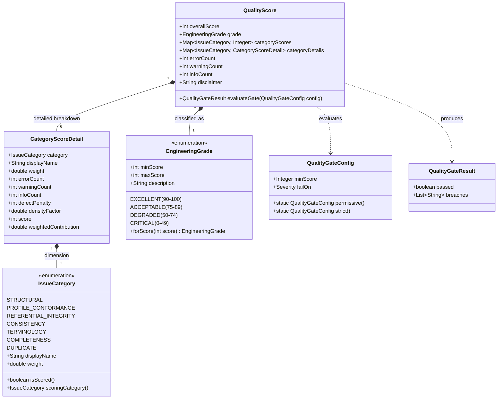

# Data Model: Phase 5 — Deterministic Multi-Category Quality Scoring Model

## Overview

The data model for Phase 5 represents the core entities, value objects, and records required for deterministic multi-category quality scoring, grade assignment, deduction traceability, and quality gate policy evaluation.

All models are pure, immutable Java records or classes located in `org.fhirlint.core.model` (or `org.fhirlint.core.scoring`), completely framework-agnostic and stateless.

---

## Entity Relationship Diagram



---

## Detailed Entity Definitions

### 1. `QualityScore`

The aggregate root representing the evaluated data hygiene and technical quality of a FHIR dataset.

- **Package**: `org.fhirlint.core.model`
- **Immutability**: Fully immutable, thread-safe.
- **Fields**:
  | Field | Type | Description |
  | :--- | :--- | :--- |
  | `overallScore` | `int` | Composite quality score bounded in $[0, 100]$. |
  | `grade` | `EngineeringGrade` | Categorical grade tier (`EXCELLENT`, `ACCEPTABLE`, `DEGRADED`, `CRITICAL`). |
  | `categoryScores` | `Map<IssueCategory, Integer>` | Category scores keyed by canonical category ($0–100$). |
  | `categoryDetails` | `Map<IssueCategory, CategoryScoreDetail>` | Rich explainability breakdown per category. |
  | `errorCount` | `int` | Total count of detected `ERROR` issues. |
  | `warningCount` | `int` | Total count of detected `WARNING` issues. |
  | `infoCount` | `int` | Total count of detected `INFO` notices. |
  | `disclaimer` | `String` | Mandatory non-clinical engineering indicator statement. |

- **Constants**:
  ```java
  public static final String NON_CLINICAL_DISCLAIMER =
      "Quality scores produced by FHIRLint reflect technical data hygiene and engineering standards rather than clinical, medical, or regulatory compliance measurements.";
  ```

- **Methods**:
  - `public static QualityScore calculate(int totalResources, List<QualityIssue> issues)`: Computes score from raw resources and issue list.
  - `public QualityGateResult evaluateGate(QualityGateConfig config)`: Evaluates policy thresholds against the score.
  - Standard getters for all fields.

---

### 2. `CategoryScoreDetail`

A record providing full mathematical traceability for an individual category's score.

- **Package**: `org.fhirlint.core.model`
- **Fields**:
  | Field | Type | Description |
  | :--- | :--- | :--- |
  | `category` | `IssueCategory` | Canonical quality category. |
  | `displayName` | `String` | Human-readable name (e.g. "Referential Integrity"). |
  | `weight` | `double` | Weight factor in composite score ($0.00–1.00$). |
  | `errorCount` | `int` | Count of errors contributing to this category. |
  | `warningCount` | `int` | Count of warnings contributing to this category. |
  | `infoCount` | `int` | Count of info notices (penalty = 0). |
  | `defectPenalty` | `int` | Calculated penalty: $(N_{\text{err}} \times 15) + (N_{\text{warn}} \times 3)$. |
  | `densityFactor` | `double` | Density factor: $\text{penalty} / (\max(N, 1) \times 15)$. |
  | `score` | `int` | Clamped score: $\text{round}(\max(0, 100 \times (1 - \min(1.0, \text{density}))))$. |
  | `weightedContribution` | `double` | Contribution to composite: $\text{weight} \times \text{score}$. |

---

### 3. `EngineeringGrade` (Enum)

The four-tier standardized engineering rating scale from ADR-005.

- **Package**: `org.fhirlint.core.model` (nested in `QualityScore` or top-level)
- **Values**:
  | Grade | Min Score | Max Score | Description |
  | :--- | :---: | :---: | :--- |
  | `EXCELLENT` | 90 | 100 | *"High integrity, safe for automated ingestion"* |
  | `ACCEPTABLE` | 75 | 89 | *"Minor non-critical warnings; downstream review recommended"* |
  | `DEGRADED` | 50 | 74 | *"Contains broken references or chronological inconsistencies"* |
  | `CRITICAL` | 0 | 49 | *"Severe structural or relational failures; ingestion should halt"* |

- **Factory**:
  - `public static EngineeringGrade forScore(int score)`: Returns the grade corresponding to score thresholds.

---

### 4. `IssueCategory` (Enum Extension)

Enumerates the quality dimensions evaluated by FHIRLint.

- **Package**: `org.fhirlint.core.model`
- **Values & Weights**:
  | Enum Value | Display Name | Scoring Weight | Target Scoring Category |
  | :--- | :--- | :---: | :--- |
  | `STRUCTURAL` | "Structural Conformance" | 0.20 | `STRUCTURAL` |
  | `PROFILE_CONFORMANCE` | "Profile Conformance" | 0.20 | `PROFILE_CONFORMANCE` |
  | `REFERENTIAL_INTEGRITY`| "Referential Integrity" | 0.25 | `REFERENTIAL_INTEGRITY`|
  | `CONSISTENCY` | "Cross-Resource Consistency" | 0.15 | `CONSISTENCY` |
  | `TERMINOLOGY` | "Terminology Quality" | 0.10 | `TERMINOLOGY` |
  | `COMPLETENESS` | "Data Completeness" | 0.10 | `COMPLETENESS` |
  | `DUPLICATE` | "Entity Deduplication" | 0.00 | `CONSISTENCY` *(mapped via FR-013)* |

- **Category Mapping & Scoring Methods**:
  ```java
  public IssueCategory scoringCategory() {
      return this == DUPLICATE ? CONSISTENCY : this;
  }

  public boolean isScored() {
      return this != DUPLICATE;
  }
  ```
  *(Note: `categoryScores` and `categoryDetails` contain strictly the 6 scored canonical categories where `isScored() == true`.)*

---

### 5. `QualityGateConfig`

Immutable configuration specifying CI/CD pass/fail policies.

- **Package**: `org.fhirlint.core.model`
- **Fields**:
  | Field | Type | Description |
  | :--- | :--- | :--- |
  | `minScore` | `Integer` | Optional minimum overall score required ($0–100$). Nullable/optional. |
  | `failOn` | `Severity` | Optional maximum allowable severity threshold (`ERROR`, `WARNING`). Nullable/optional. |

- **Factory Methods**:
  - `QualityGateConfig.of(Integer minScore, Severity failOn)`
  - `QualityGateConfig.minScore(int minScore)`
  - `QualityGateConfig.failOn(Severity failOn)`
  - `QualityGateConfig.none()`: No policy constraints (always passes).

---

### 6. `QualityGateResult`

The outcome of quality gate evaluation against a dataset's score.

- **Package**: `org.fhirlint.core.model`
- **Fields**:
  | Field | Type | Description |
  | :--- | :--- | :--- |
  | `passed` | `boolean` | `true` if all configured policies are satisfied, `false` otherwise. |
  | `breaches` | `List<String>` | Unmodifiable list of failure reasons explaining each breach. |

- **Factory Methods**:
  - `QualityGateResult.pass()`: Returns a passed result with an empty breach list.
  - `QualityGateResult.fail(List<String> breaches)`: Returns a failed result with the specified breach messages.
