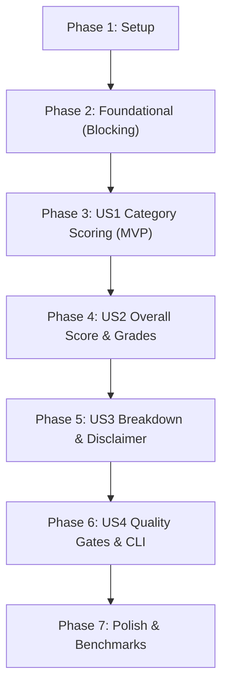

# Tasks: Phase 5 — Deterministic Multi-Category Quality Scoring Model

**Branch**: `005-deterministic-quality-scoring` | **Date**: 2026-09-27 | **Spec**: [spec.md](spec.md) | **Plan**: [plan.md](plan.md)

## Summary

Implement the deterministic multi-category quality scoring model, deduction explainability breakdowns, canonical non-clinical engineering disclaimer, and CI/CD quality gate engine for FHIRLint adhering to ADR-005, PRODUCT_SPEC.md, and Constitution v2.0.0.

---

## Phase 1: Setup (Shared Infrastructure)

**Purpose**: Verify repository baseline and configure shared category mapping infrastructure.

- [X] T001 Verify project baseline and existing automated test suite passes via `./gradlew test`
- [X] T002 [P] Update `IssueCategory` enum in `src/main/java/org/fhirlint/core/model/IssueCategory.java` to add `scoringCategory()` mapping `DUPLICATE` -> `CONSISTENCY` (FR-013), `isScored()` returning `this != DUPLICATE`, and define canonical weights

---

## Phase 2: Foundational (Core Models & Types)

**Purpose**: Core data structures and records that MUST be complete before user stories can be implemented.

**⚠️ CRITICAL**: No user story work can begin until this foundational phase is complete.

- [X] T003 [P] Update `QualityScore.Grade` enum in `src/main/java/org/fhirlint/core/model/QualityScore.java` (and create top-level `EngineeringGrade` alias if needed) defining `EXCELLENT` (90–100, "High integrity, safe for automated ingestion"), `ACCEPTABLE` (75–89, "Minor non-critical warnings; downstream review recommended"), `DEGRADED` (50–74, "Contains broken references or chronological inconsistencies"), and `CRITICAL` (0–49, "Severe structural or relational failures; ingestion should halt") with `forScore(int)` lookup
- [X] T004 [P] Create `CategoryScoreDetail` record in `src/main/java/org/fhirlint/core/model/CategoryScoreDetail.java` capturing `category`, `displayName`, `weight`, `errorCount`, `warningCount`, `infoCount`, `defectPenalty`, `densityFactor`, `score`, and `weightedContribution`
- [X] T005 [P] Create `QualityGateConfig` record in `src/main/java/org/fhirlint/core/model/QualityGateConfig.java` validating `minScore` ($\ge 0$, nullable) and `failOn` (`Severity`, nullable) with static factory methods (`of`, `minScore`, `failOn`, `none`)
- [X] T006 [P] Create `QualityGateResult` record in `src/main/java/org/fhirlint/core/model/QualityGateResult.java` capturing `passed` (boolean) and `breaches` (unmodifiable `List<String>`) with static factory methods (`pass`, `fail`)

**Checkpoint**: Foundation ready — user story implementation can proceed.

---

## Phase 3: User Story 1 - Defect-Density Category Scoring & Severity Penalties (Priority: P1) 🎯 MVP

**Goal**: Compute deterministic, volume-normalized quality scores ($0–100$) for each of the six quality categories (`structural`, `profileConformance`, `referentialIntegrity`, `consistency`, `terminology`, `completeness`) applying severity penalties (error = 15, warning = 3, info = 0), volume normalization against $\max(N, 1) \times 15$, clamping at 0, and mapping `DUPLICATE` findings into `consistency`.

**Independent Test**: Supply synthetic issue lists with varying resource counts and verify that each category calculates the exact defect penalty, density factor, and clamped score ($0–100$) matching ADR-005.

### Tests for User Story 1

- [X] T007 [P] [US1] Unit test category scoring formulas, volume normalization, severity penalty weighting, clamping at 0, and duplicate mapping in `src/test/java/org/fhirlint/core/QualityScoreCategoryTest.java`

### Implementation for User Story 1

- [X] T008 [US1] Implement volume-normalized category scoring algorithm with penalty weighting ($15/3/0$), density factor computation, clamping, duplicate category remapping to consistency (FR-013), and populating strictly the 6 canonical scored categories in `src/main/java/org/fhirlint/core/model/QualityScore.java`

**Checkpoint**: User Story 1 complete and independently testable (MVP reached).

---

## Phase 4: User Story 2 - Weighted Overall Composite Score & Engineering Grade Classification (Priority: P2)

**Goal**: Combine the six category scores into a single weighted composite overall quality score ($0–100$) using fixed weights (Referential Integrity: 25%, Structural Conformance: 20%, Profile Conformance: 20%, Consistency: 15%, Terminology: 10%, Completeness: 10%), apply deterministic half-up rounding, assign the four-tier engineering grade, and verify 100% reproducible execution.

**Independent Test**: Supply varied category score combinations and verify that overall score rounds half-up deterministically, maps to the correct `EngineeringGrade`, and produces zero non-deterministic drift across 10,000 iterations.

### Tests for User Story 2

- [X] T009 [P] [US2] Unit test weighted composite score calculation, half-up rounding, grade tier boundary mappings, and 10,000-iteration deterministic reproducibility in `src/test/java/org/fhirlint/core/QualityScoreOverallTest.java`

### Implementation for User Story 2

- [X] T010 [US2] Implement composite score weighted calculation, half-up rounding, clamping to $[0, 100]$, and `EngineeringGrade` classification in `src/main/java/org/fhirlint/core/model/QualityScore.java`

**Checkpoint**: User Stories 1 and 2 work together independently.

---

## Phase 5: User Story 3 - Explainable Score Breakdown & Deduction Traceability (Priority: P3)

**Goal**: Provide an explainable score breakdown exposing `CategoryScoreDetail` for all six categories and embed the mandatory canonical non-clinical engineering indicator disclaimer (`QualityScore.NON_CLINICAL_DISCLAIMER`) across all output representations.

**Independent Test**: Verify that `getCategoryDetails()` exposes all metrics for all six categories, every deduction matches $(N_{\text{err}} \times 15) + (N_{\text{warn}} \times 3)$, and `getDisclaimer()` returns the exact canonical statement.

### Tests for User Story 3

- [X] T011 [P] [US3] Unit test score breakdown explainability, point deduction traceability, and non-clinical disclaimer retrieval in `src/test/java/org/fhirlint/core/QualityScoreExplainabilityTest.java`

### Implementation for User Story 3

- [X] T012 [US3] Add `categoryDetails` map, `NON_CLINICAL_DISCLAIMER` constant, getter accessors, and preserve backward-compatible 6-parameter constructor overload in `src/main/java/org/fhirlint/core/model/QualityScore.java`
- [X] T013 [US3] Update ANSI table renderer in `src/main/java/org/fhirlint/cli/renderer/ConsoleTableRenderer.java` and JSON serializer in `src/main/java/org/fhirlint/cli/renderer/JsonReportRenderer.java` to include the non-clinical engineering disclaimer

**Checkpoint**: User Stories 1, 2, and 3 are fully functional and explainable.

---

## Phase 6: User Story 4 - Quality Gate Threshold Evaluation (Priority: P4)

**Goal**: Implement automated policy evaluation for CI/CD gates based on minimum overall score (`--min-score`) and maximum permissible severity (`--fail-on`), capturing all breach descriptions without early short-circuiting and wiring gate results into CLI exit codes.

**Independent Test**: Verify quality gate pass/fail verdicts and multi-breach diagnostic messages for score breaches, severity breaches, and simultaneous breaches; verify CLI exits 0 on pass and 1 on gate failure.

### Tests for User Story 4

- [X] T014 [P] [US4] Unit test quality gate evaluation, pass/fail rules, and multi-breach non-short-circuiting diagnostics in `src/test/java/org/fhirlint/core/QualityGateTest.java`
- [X] T015 [P] [US4] Integration test CLI quality gate exit codes (`0` on pass, `1` on gate failure) and breach reporting in `src/test/java/org/fhirlint/cli/QualityGateCliTest.java`

### Implementation for User Story 4

- [X] T016 [US4] Implement count-based $O(1)$ `evaluateGate(QualityGateConfig)` in `src/main/java/org/fhirlint/core/model/QualityScore.java`, add `evaluateGate` on `LintReport`, and preserve backward-compatible `passes(int, Severity)` overload in `src/main/java/org/fhirlint/core/model/LintReport.java`
- [X] T017 [US4] Update `ValidateCommand` in `src/main/java/org/fhirlint/cli/command/ValidateCommand.java` to evaluate `QualityGateConfig`, print quality gate breaches to stderr upon failure, and return exit code 1

**Checkpoint**: Complete CI/CD quality gate enforcement functioning end-to-end.

---

## Phase 7: Polish & Cross-Cutting Concerns

**Purpose**: Performance verification, regression suite alignment, and quickstart scenario validation.

- [X] T018 [P] Performance benchmark test verifying 100,000 resources and 10,000 issues scored in < 5 milliseconds in `src/test/java/org/fhirlint/core/QualityScoreBenchmarkTest.java`
- [X] T019 [P] Update existing regression suites (`QualityScoreTest.java`, `ReportRenderersTest.java`, and `FhirLintCliTest.java`) to align with updated models, non-clinical grade descriptions, and gate exit code contracts
- [X] T020 Execute full quickstart validation scenarios from `quickstart.md` and verify entire project check passes via `./gradlew check`

---

## Dependencies & Execution Order

### Phase Dependencies

### User Story Dependencies

- **User Story 1 (P1)**: Depends on Foundational Phase (Phase 2). Delivers category score normalization and duplicate mapping.
- **User Story 2 (P2)**: Depends on US1 category scores. Computes weighted overall composite score and engineering grade.
- **User Story 3 (P3)**: Depends on US2. Exposes rich deduction details and non-clinical disclaimer.
- **User Story 4 (P4)**: Depends on US2/US3. Evaluates quality gate thresholds (`--min-score`, `--fail-on`) against score and issues.

### Parallel Opportunities

- **Phase 1**: `T002` can be executed in parallel with baseline checks.
- **Phase 2**: `T003`, `T004`, `T005`, and `T006` create independent model files and can be built completely in parallel.
- **Phase 3**: `T007` (test) is written before `T008` (implementation).
- **Phase 4**: `T009` (test) is written before `T010` (implementation).
- **Phase 5**: `T011` (test) and `T012` / `T013` can be parallelized across model and renderers.
- **Phase 6**: `T014` and `T015` (tests) can be created in parallel; `T016` and `T017` handle core model and CLI layer.
- **Phase 7**: `T018` (benchmark) and `T019` (regression updates) can run in parallel before `T020` final validation.

---

## Implementation Strategy

### MVP First (User Story 1 Only)

1. Complete Phase 1 (Setup) and Phase 2 (Foundational models).
2. Complete Phase 3 (User Story 1 category scoring).
3. **STOP and VALIDATE**: Run `./gradlew test --tests org.fhirlint.core.QualityScoreCategoryTest`.
4. Delivers working volume-normalized category scoring engine.

### Incremental Delivery

1. Phase 1 + Phase 2 $\rightarrow$ Foundations ready.
2. Phase 3 (US1) $\rightarrow$ Category scoring working (MVP).
3. Phase 4 (US2) $\rightarrow$ Composite overall score and engineering grades operational.
4. Phase 5 (US3) $\rightarrow$ Full deduction explainability and non-clinical disclaimer active.
5. Phase 6 (US4) $\rightarrow$ CI/CD quality gate enforcement and exit code contracts integrated.
6. Phase 7 $\rightarrow$ Performance benchmarks validated (< 5 ms) and full `./gradlew check` passing.
