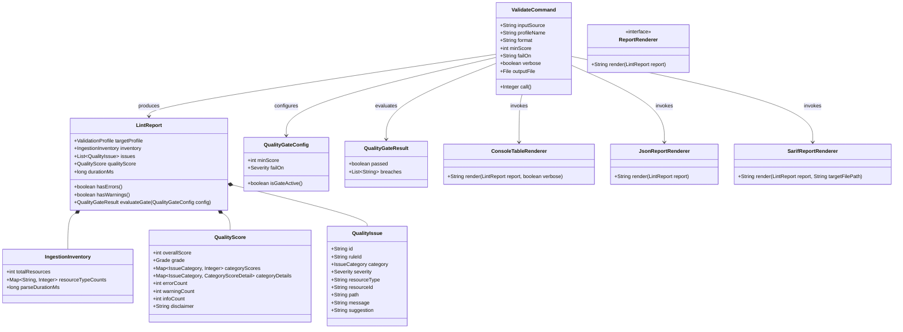
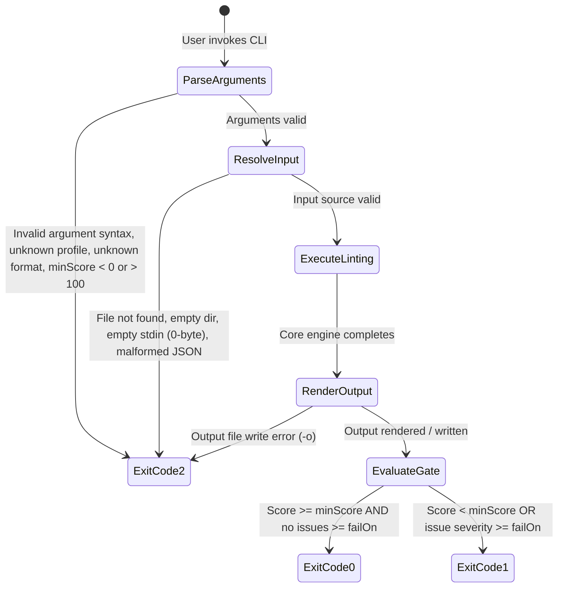

# Data Model: Phase 6 — Developer Experience and Standalone CLI Design

**Branch**: `006-developer-experience-cli` | **Date**: 2026-09-27 | **Spec**: [spec.md](spec.md)

## Overview

The data model for Phase 6 encompasses the configuration, execution context, reporting representations, and interface contracts governing the developer experience across both the command-line interface and embeddable Java library.

---

## 1. Domain Entities & Models

---

## 2. Entity Specifications

### 2.1 CLI Execution Parameters (`ValidateCommand`)

| Parameter / Option | CLI Flags | Type | Default | Permitted Values / Constraints | Validation Rule |
| :--- | :--- | :--- | :--- | :--- | :--- |
| `inputSource` | `<file\|directory\|->` (Positional 0) | `String` | *(required)* | File path, Directory path, or `"-"` for stdin | Path must exist; if directory, must contain `>= 1` `.json` file; if stdin, must be non-empty. Violations exit with code `2`. |
| `profileName` | `-p, --profile` | `String` | `"US_CORE"` | `"US_CORE"`, `"BASE_R4"` (case-insensitive) | Must map to `ValidationProfile`. Unrecognized values exit with code `2`. |
| `format` | `-f, --format` | `String` | `"table"` | `"table"`, `"json"`, `"sarif"` (case-insensitive) | Unrecognized values exit with code `2`. |
| `minScore` | `--min-score` | `int` | `0` | `0` to `100` inclusive | Must satisfy `0 <= minScore <= 100`. Values `< 0` or `> 100` exit with code `2`. |
| `failOn` | `--fail-on` | `String` | `"error"` | `"error"`, `"warning"`, `"info"`, `"none"`, `"off"` (case-insensitive) | Must map to `Severity` or `null` (for none/off). Unrecognized values exit with code `2`. |
| `verbose` | `-v, --verbose` | `boolean` | `false` | `true`, `false` | Flag present sets to `true`. |
| `outputFile` | `-o, --output` | `File` | `null` | Writable file path | Must be writable. Parent directories created automatically. I/O failure exits with code `2`. |

---

### 2.2 Reporting Models

#### `LintReport`
- **`targetProfile`** (`ValidationProfile`): The profile used for validation (`US_CORE` or `BASE_R4`).
- **`inventory`** (`IngestionInventory`): Total resource count and breakdown by FHIR resource type (`Patient`, `Observation`, etc.).
- **`issues`** (`List<QualityIssue>`): Immutable collection of all detected diagnostic issues across all phases.
- **`qualityScore`** (`QualityScore`): Composite score (0–100), category breakdown, grade tier, and non-clinical disclaimer.
- **`durationMs`** (`long`): Total end-to-end linting duration in milliseconds.

#### `QualityIssue`
- **`id`** (`String`): Unique issue identifier.
- **`ruleId`** (`String`): Standard rule code (`REF-001`, `USCORE_OBS_CATEGORY`, etc.).
- **`category`** (`IssueCategory`): Canonical dimension (`STRUCTURAL`, `PROFILE_CONFORMANCE`, `REFERENTIAL_INTEGRITY`, `CONSISTENCY`, `TERMINOLOGY`, `COMPLETENESS`).
- **`severity`** (`Severity`): `ERROR`, `WARNING`, or `INFO`.
- **`resourceType`** (`String`): Target resource type (e.g. `Observation`).
- **`resourceId`** (`String`): Target resource ID (e.g. `obs-123`).
- **`path`** (`String`): FHIRPath or dot-notated element path (e.g. `Observation.subject.reference`).
- **`message`** (`String`): Actionable human-readable explanation of defect.
- **`suggestion`** (`String`): Actionable remediation advice for resolution.

---

## 3. Exit Code State Transitions

---

## 4. Output Renderers

### `ConsoleTableRenderer`
- **Output**: Multi-section ANSI formatted text string.
- **Components**: Header box, score badge, metrics summary, resource distribution, category progress bars, prioritized issue diagnostics with location context `(ResourceType/Id: path)` and remediation suggestion, truncation indicator (> 10 issues), and non-clinical engineering disclaimer.

### `JsonReportRenderer`
- **Output**: Standard formatted JSON string adhering to `LintReport` JSON schema.
- **Components**: Direct serialization of all report fields including inventory, issues, score details, and disclaimer.

### `SarifReportRenderer`
- **Output**: Standardized OASIS SARIF v2.1.0 JSON string.
- **Components**:
  - Root: `$schema`, `version: "2.1.0"`, `runs`
  - Tool driver: `name: "FHIRLint"`, `version: "0.1.0"`, `informationUri`
  - Rules: Catalog of rules with `id`, `name`, `shortDescription`, and `fullDescription` (including dynamic registration for uncataloged rules)
  - Properties: `runs[0].properties.disclaimer` containing the non-clinical disclaimer
  - Results: Array of findings mapping to `ruleId`, `level` (`error`, `warning`, `note`), `message.text`, and `physicalLocation.artifactLocation.uri` + `region`.
