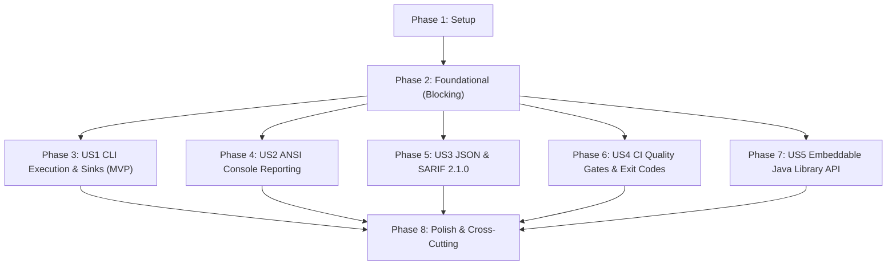

# Tasks: Phase 6 — Developer Experience and Standalone CLI Design

**Branch**: `006-developer-experience-cli` | **Date**: 2026-09-27 | **Spec**: [spec.md](spec.md) | **Plan**: [plan.md](plan.md)

## Summary

Deliver a polished, developer-focused command-line interface (CLI) and embeddable Java library API for FHIRLint adhering to ADR-006, ADR-009, PRODUCT_SPEC.md, and Constitution v2.0.0. Features include POSIX argument parsing, standard three-tier exit codes (`0`, `1`, `2`), human-centric ANSI scorecards with enriched location diagnostics and issue truncation, machine-readable JSON, OASIS SARIF v2.1.0 for GitHub Code Scanning, hardened file output redirection, and the fluent `FhirLinter` library API.

---

## Phase 1: Setup (Shared Infrastructure)

**Purpose**: Verify project baseline and existing automated test suites.

- [X] T001 Verify project baseline and existing automated test suite passes via `./gradlew test`

---

## Phase 2: Foundational (CLI Argument & Boundary Hardening)

**Purpose**: Core CLI validation and error handling prerequisites that MUST be complete before user story refinements.

**⚠️ CRITICAL**: No user story work can begin until this foundational phase is complete.

- [X] T002 [P] Implement strict format validation in `src/main/java/org/fhirlint/cli/command/ValidateCommand.java` to validate `--format` against `table`, `json`, `sarif` (case-insensitive) and reject unknown values with `Error: Unsupported format '<format>'. Supported formats: table, json, sarif.` and exit code `2`
- [X] T003 [P] Implement strict minimum score boundary validation in `src/main/java/org/fhirlint/cli/command/ValidateCommand.java` enforcing `0 <= minScore <= 100`, rejecting values `< 0` or `> 100` with `Error: --min-score must be between 0 and 100` and exit code `2`
- [X] T004 [P] Update existing CLI test suites (`src/test/java/org/fhirlint/cli/QualityGateCliTest.java`, `src/test/java/org/fhirlint/cli/FhirLintCliTest.java`, `src/test/java/org/fhirlint/cli/FhirLintPhase4CliTest.java`) that passed `--min-score 101` on clean bundles to use `--min-score 100` on defective bundles (e.g. `messy-bundle.json`) to preserve exit code `1` assertions, and align negative min-score assertion in `QualityGateCliTest.java#L105` to assert `Error: --min-score must be between 0 and 100`

**Checkpoint**: CLI argument validation hardened — user story implementations can proceed.

---

## Phase 3: User Story 1 - POSIX-Compliant CLI Execution & Flexible Input Sinks (Priority: P1) 🎯 MVP

**Goal**: Accept single local FHIR JSON files, directories of files (recursively scanned), and standard input streams (`-`), validating against target profiles (`US_CORE`, `BASE_R4`), supporting file output redirection (`-o, --output`) with automatic directory creation and UTF-8 encoding, and handling 0-byte streams and missing files with exit code `2`.

**Independent Test**: Execute the CLI with individual JSON files, directories containing multiple resources, and piped stdin (`cat bundle.json | fhir-lint validate -`), verifying dataset parsing, target profile validation, file writing, and appropriate POSIX exit codes (`0` or `2`).

### Tests for User Story 1

- [X] T005 [P] [US1] Add end-to-end tests for file output redirection (`-o`), directory scanning, empty 0-byte stdin stream rejection (exit code `2`), non-existent files (exit code `2`), and empty directories (exit code `2`) in `src/test/java/org/fhirlint/cli/FhirLintCliTest.java`

### Implementation for User Story 1

- [X] T006 [US1] Update `src/main/java/org/fhirlint/core/parser/FhirBundleParser.java` to detect 0-byte/empty input streams and throw `FhirParseException` with `Input stream is empty`
- [X] T007 [US1] Harden output file redirection in `src/main/java/org/fhirlint/cli/command/ValidateCommand.java` with a null-check `if (outputFile.getParentFile() != null) outputFile.getParentFile().mkdirs();` to prevent NPE on relative CWD paths, and write with `StandardCharsets.UTF_8`
- [X] T008 [US1] Verify and refine directory recursive `.json` file discovery and error handling for empty directories in `src/main/java/org/fhirlint/cli/command/ValidateCommand.java`

**Checkpoint**: User Story 1 complete and independently testable (MVP reached).

---

## Phase 4: User Story 2 - Human-Centric ANSI Colorized Console Reporting (Priority: P2)

**Goal**: Render an ANSI colorized console report displaying the summary scorecard, quality score badge with grade tier, execution metrics, resource distribution table, category progress bars, prioritized issue diagnostics with enriched location context `(ResourceType/Id: path)` and remediation suggestions, top-10 pagination with `-v, --verbose` expansion, and the mandatory non-clinical disclaimer.

**Independent Test**: Execute the CLI with `--format table` on clean and messy bundles, verifying the presence of scorecard banners, progress bars, enriched location strings, truncation notices (> 10 items), verbose expansion (`-v`), and the non-clinical disclaimer.

### Tests for User Story 2

- [X] T009 [P] [US2] Add unit tests in `src/test/java/org/fhirlint/cli/renderer/ReportRenderersTest.java` verifying console table score badge colorization, enriched location formatting `(ResourceType/Id: path)`, top-10 issue truncation, `-v` verbose expansion, and non-clinical disclaimer rendering

### Implementation for User Story 2

- [X] T010 [US2] Update `src/main/java/org/fhirlint/cli/renderer/ConsoleTableRenderer.java` to format findings with enriched location context combining `resourceType`, `resourceId`, and `path` (e.g. `(Observation/obs-1: Observation.category)`)
- [X] T011 [US2] Implement top-10 issue truncation in `src/main/java/org/fhirlint/cli/renderer/ConsoleTableRenderer.java` when `verbose == false`, appending a truncation notice prompting the user to supply `-v` or `--verbose` to view all findings
- [X] T012 [US2] Verify header banner, score badge color mapping, category progress bar rendering, resource distribution table, and non-clinical engineering disclaimer in `src/main/java/org/fhirlint/cli/renderer/ConsoleTableRenderer.java`

**Checkpoint**: User Stories 1 and 2 work together independently.

---

## Phase 5: User Story 3 - Machine-Readable CI/CD Integrations: Structured JSON & SARIF 2.1.0 (Priority: P3)

**Goal**: Output clean, machine-readable JSON and standards-compliant OASIS SARIF v2.1.0 reports, placing the non-clinical disclaimer in `runs[0].properties.disclaimer`, dynamically declaring uncataloged rule IDs in `driver.rules`, and emitting valid RFC-3986 relative URIs (`"stdin"`) for standard input.

**Independent Test**: Execute the CLI with `--format json` and `--format sarif`, verifying that JSON matches the `LintReport` model, stdout receives only pure payloads, SARIF conforms to OASIS 2.1.0 schema, and SARIF results link to declared rules and valid artifact URIs.

### Tests for User Story 3

- [X] T013 [P] [US3] Add unit tests in `src/test/java/org/fhirlint/cli/renderer/ReportRenderersTest.java` asserting SARIF 2.1.0 property bag disclaimer placement, dynamic rule declaration for uncataloged rules (e.g. `USCORE_OBS_CATEGORY`), and RFC-3986 URI sanitization for stdin
- [X] T014 [P] [US3] Add CLI integration tests in `src/test/java/org/fhirlint/cli/FhirLintCliTest.java` verifying that piped execution (`cat bundle.json | fhir-lint validate - -f json | jq .`) emits pure JSON to stdout with no banner pollution

### Implementation for User Story 3

- [X] T015 [US3] Update `src/main/java/org/fhirlint/cli/renderer/SarifReportRenderer.java` to serialize the non-clinical engineering disclaimer into the SARIF run property bag (`runs[0].properties.disclaimer`)
- [X] T016 [US3] Update `src/main/java/org/fhirlint/cli/renderer/SarifReportRenderer.java` to dynamically declare any reported issue rule ID in `runs[0].tool.driver.rules` if not already present in the catalog, using a `Set<String> declaredRuleIds` to prevent duplicate rule entries
- [X] T017 [US3] Update `src/main/java/org/fhirlint/cli/renderer/SarifReportRenderer.java` to sanitize artifact location URI when reading from stdin (`"-"`) to `"stdin"` or `"input.json"`
- [X] T018 [US3] Ensure `src/main/java/org/fhirlint/cli/renderer/JsonReportRenderer.java` serializes the full `LintReport` model cleanly with indentation and ISO timestamps

**Checkpoint**: Machine-readable JSON and SARIF 2.1.0 outputs fully functional.

---

## Phase 6: User Story 4 - Automated CI Quality Gates & Standard Exit Codes (Priority: P4)

**Goal**: Enforce quality gate policies via `--min-score` and `--fail-on` options, printing all breach diagnostics to stderr without early termination, and returning POSIX exit code `0` on pass, `1` on gate failure, and `2` on invocation errors.

**Independent Test**: Execute the CLI across permutations of passing and failing score thresholds and severity gates, verifying that exit code `0` occurs when thresholds pass, exit code `1` occurs when thresholds fail, and exit code `2` occurs on illegal option values.

### Tests for User Story 4

- [X] T019 [P] [US4] Add comprehensive tests in `src/test/java/org/fhirlint/cli/QualityGateCliTest.java` verifying exit code `0` on pass, exit code `1` with breach messages on score and severity failures, and exit code `2` on invalid flags (`--format invalid`, `--min-score -5`, `--min-score 105`)

### Implementation for User Story 4

- [X] T020 [US4] Verify and harden quality gate evaluation and multi-breach stderr reporting in `src/main/java/org/fhirlint/cli/command/ValidateCommand.java` ensuring exit code `1` is returned whenever `report.evaluateGate(gateConfig).passed()` is false
- [X] T021 [US4] Ensure stream isolation in `src/main/java/org/fhirlint/cli/command/ValidateCommand.java`: report output goes to stdout (or file), while breach messages and error diagnostics write exclusively to stderr

**Checkpoint**: CI/CD quality gate enforcement operating end-to-end.

---

## Phase 7: User Story 5 - Embeddable Fluent Java Library API (Priority: P5)

**Goal**: Provide an embeddable, framework-agnostic fluent Java API via `FhirLinter` supporting in-memory linting of files, strings, input streams, and multi-file collections with zero database or external network overhead.

**Independent Test**: Instantiate `FhirLinter.create()` in a unit test, configure profiles and engines, execute `.lint(...)` across `File`, `InputStream`, `String`, and `List<File>`, and assert against the resulting `LintReport` object.

### Tests for User Story 5

- [X] T022 [P] [US5] Add unit tests in `src/test/java/org/fhirlint/core/FhirLinterTest.java` verifying fluent initialization, profile selection, multi-file collection aggregation, and stream consumption via `FhirLinter`

### Implementation for User Story 5

- [X] T023 [US5] Review and refine `src/main/java/org/fhirlint/core/FhirLinter.java` to guarantee complete alignment with `specs/006-developer-experience-cli/contracts/java-library-api-contract.md` and ensure thread-safety and immutable report returns

**Checkpoint**: Embeddable Java library API complete and verified.

---

## Phase 8: Polish & Cross-Cutting Concerns

**Purpose**: Performance verification, quickstart validation, and regression test suite execution.

- [X] T024 [P] Verify total automated test suite execution completes in under 3.0 seconds via `./gradlew test`
- [X] T025 Execute all runnable validation scenarios from `specs/006-developer-experience-cli/quickstart.md` and verify expected console outputs and exit codes
- [X] T026 Execute full project check via `./gradlew check` to ensure zero compilation warnings, checkstyle violations, or failing tests

---

## Dependencies & Execution Order

### Phase Dependencies

### User Story Dependencies

- **User Story 1 (P1)**: Starts immediately after Foundational Phase 2. Core execution foundation.
- **User Story 2 (P2)**: Depends on Phase 2; enhances terminal output.
- **User Story 3 (P3)**: Depends on Phase 2; enhances machine-readable serialization.
- **User Story 4 (P4)**: Depends on Phase 2 and US1; enforces exit codes and gate policies.
- **User Story 5 (P5)**: Depends on Phase 2; validates core embeddable library interface.
- **Polish (Phase 8)**: Depends on all user stories being complete.

---

## Parallel Opportunities

- **Foundational Phase 2**: Tasks T002, T003, and T004 can run in parallel.
- **User Story Phases (Phases 3–7)**:
  - T005 (US1 tests) can run in parallel with implementation preparation.
  - T009 (US2 tests) can run in parallel with T010/T011.
  - T013 and T014 (US3 tests) can run in parallel with T015–T018.
  - T019 (US4 tests) can run in parallel with T020/T021.
  - T022 (US5 tests) can run in parallel with T023.
- Once Foundational Phase 2 is complete, US2 (table renderer), US3 (JSON/SARIF renderers), and US5 (library API) can proceed in parallel because they target distinct classes (`ConsoleTableRenderer`, `SarifReportRenderer`, `FhirLinter`).

---

## Implementation Strategy

### MVP First (User Story 1 Only)

1. Complete **Phase 1: Setup** (T001)
2. Complete **Phase 2: Foundational** (T002–T004: format validation, min-score boundary validation, test alignment)
3. Complete **Phase 3: User Story 1** (T005–T008: 0-byte stream handling, output file writing, directory scanning)
4. **Validate MVP**: Test `fhir-lint validate <file|dir|->` with exit codes `0` and `2`.

### Incremental Delivery

1. Foundation + US1 → Basic POSIX CLI runs (MVP).
2. Add US2 → Rich human-centric ANSI scorecards with enriched location diagnostics.
3. Add US3 → CI/CD automation with clean JSON and OASIS SARIF 2.1.0 for GitHub PR annotations.
4. Add US4 → Complete CI quality gates (`--min-score`, `--fail-on`) with exit code `1`.
5. Add US5 → Programmatic JVM library API verified.
6. Phase 8 Polish → Comprehensive check and quickstart validation.
