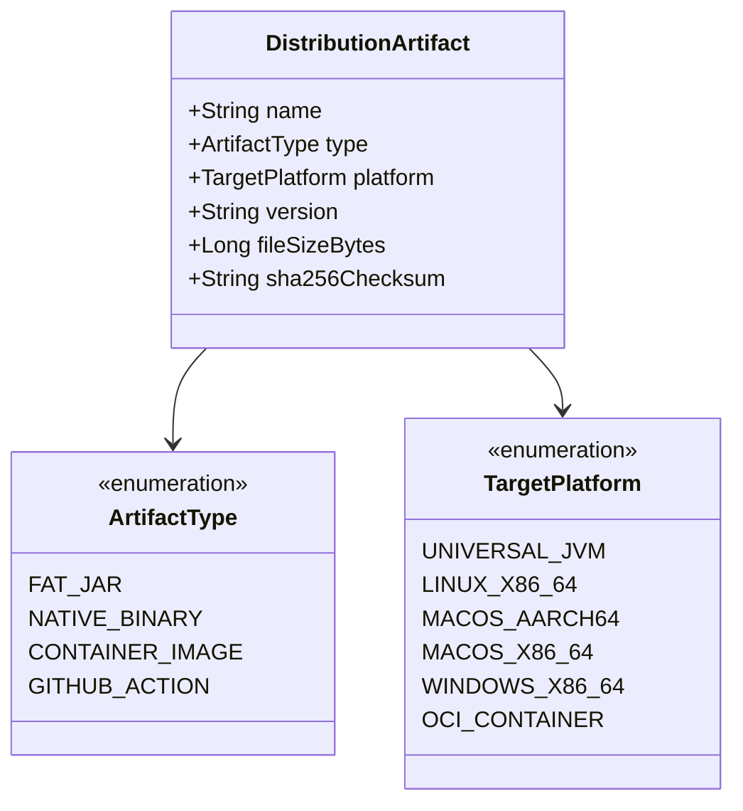
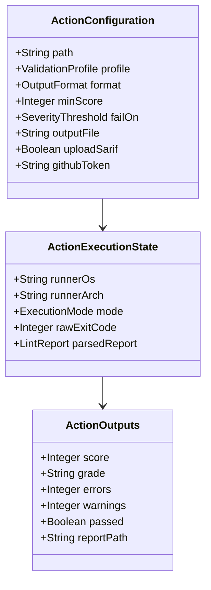
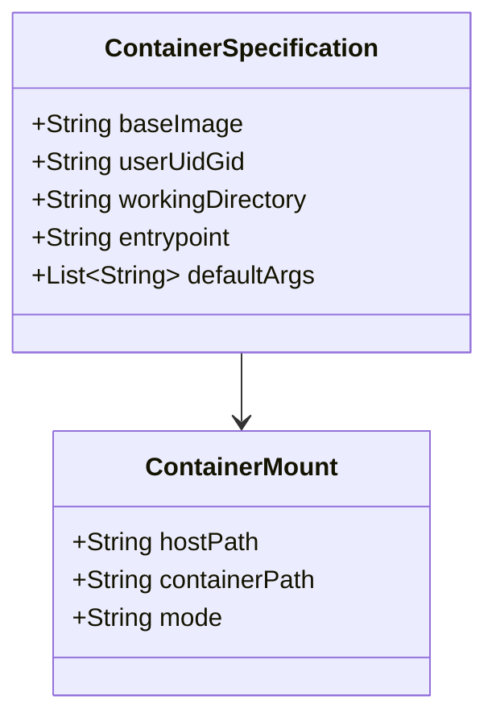

# Data Model: Phase 7 Standalone Packaging & CI/CD Automation

**Feature**: Phase 7 — Standalone Packaging, Native Image Compilation, and CI/CD Automation
**Date**: 2026-09-28
**Spec Reference**: [spec.md](./spec.md)

---

## 1. Distribution Artifact Entities



### Entity: `DistributionArtifact`
Represents any packaged release artifact produced by the build pipeline.

| Field | Type | Description | Example |
| :--- | :--- | :--- | :--- |
| `name` | String | Standardized filename of the artifact | `fhir-lint-linux-x86_64` |
| `type` | ArtifactType | Format classification | `NATIVE_BINARY` |
| `platform` | TargetPlatform | Target OS and architecture | `LINUX_X86_64` |
| `version` | String | Semantic version tag | `0.1.0` |
| `fileSizeBytes` | Long | Total size of artifact in bytes | `45281920` |
| `sha256Checksum` | String | 64-character hex SHA-256 cryptographic digest | `e3b0c44298fc1c149afbf4c8996fb92427ae41e4649b934ca495991b7852b855` |

---

## 2. GitHub Action Configuration & Execution Model



### Entity: `ActionConfiguration`
Encapsulates workflow inputs passed into `action.yml`.

| Field | Type | Required | Default | Description |
| :--- | :--- | :---: | :--- | :--- |
| `path` | String | Yes | None | Path to target FHIR file or directory |
| `profile` | ValidationProfile | No | `US_CORE` | Target validation profile (`US_CORE` or `BASE_R4`) |
| `format` | OutputFormat | No | `table` | Console display format (`table`, `json`, `sarif`) |
| `min-score` | Integer | No | `null` | Passing threshold (0–100) |
| `fail-on` | SeverityThreshold | No | `error` | Failure trigger (`error`, `warning`, `info`, `none`) |
| `output-file` | String | No | `null` | Optional path to write rendered report to |
| `upload-sarif` | Boolean | No | `false` | Upload SARIF results to GitHub Code Scanning |
| `github-token` | String | No | `${{ github.token }}` | Auth token with `security-events: write` |

### Entity: `ActionOutputs`
Structured variables exported to downstream workflow steps via `$GITHUB_OUTPUT`.

| Field | Type | Description | Source |
| :--- | :--- | :--- | :--- |
| `score` | Integer | Overall data quality score (0–100) | Extracted from internal JSON report |
| `grade` | String | Engineering grade tier | Extracted from internal JSON report |
| `errors` | Integer | Total error-level issues detected | Extracted from internal JSON report |
| `warnings` | Integer | Total warning-level issues detected | Extracted from internal JSON report |
| `passed` | Boolean | Final quality gate outcome (`true`/`false`) | Evaluated from exit code and policy |
| `report-path` | String | Path to output report if saved | Provided via `output-file` or temp file |

---

## 3. Container Runner Model



### Entity: `ContainerSpecification`
Defines runtime attributes of the OCI container image.

| Attribute | Value | Description |
| :--- | :--- | :--- |
| `Base Image` | `gcr.io/distroless/cc-debian12:nonroot` | Minimal distroless C/C++ runtime (provides glibc dynamic linker) |
| `User / Group` | `65532:65532` (`nonroot:nonroot`) | Non-root security posture |
| `Working Directory` | `/workspace` | Default volume mount root |
| `Entrypoint` | `["/fhir-lint"]` | Direct invocation of Linux native binary |
| `Default Args` | `["--help"]` | Prints usage when run without arguments |

---

## 4. AOT Reachability Metadata Schema

The GraalVM Native Image Reachability Metadata directory structure in `src/main/resources/META-INF/native-image/org.fhirlint/fhir-lint/`:

```text
META-INF/native-image/org.fhirlint/fhir-lint/
├── reflect-config.json         # Classes, methods, and fields accessed via reflection
├── resource-config.json        # Bundled classpath resources (profiles, JSON schemas, logging)
├── serialization-config.json   # Serializable types for Jackson and HAPI FHIR
└── native-image.properties     # Default build flags (--no-fallback, etc.)
```

### Entity: `ReflectionDescriptor` (`reflect-config.json`)
Declares reflection permissions for dynamic HAPI FHIR model classes and Picocli commands.

| Field | Type | Description | Example |
| :--- | :--- | :--- | :--- |
| `name` | String | Fully qualified class name | `org.hl7.fhir.r4.model.Patient` |
| `allDeclaredConstructors` | Boolean | Allow reflection on constructors | `true` |
| `allPublicMethods` | Boolean | Allow reflection on public methods | `true` |
| `allDeclaredFields` | Boolean | Allow reflection on declared fields | `true` |

### Entity: `ResourceDescriptor` (`resource-config.json`)
Declares bundled file assets accessible via ClassLoader getResource.

| Field | Type | Description | Example |
| :--- | :--- | :--- | :--- |
| `pattern` | String | Regular expression matching resource paths | `profiles/us-core/.*` |
