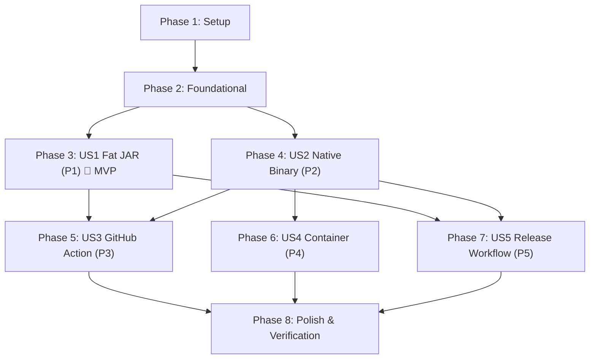

# Tasks: Phase 7 — Standalone Packaging, Native Image Compilation, and CI/CD Automation

**Input**: Design documents from `specs/007-standalone-packaging-distribution/` (`plan.md`, `spec.md`, `data-model.md`, `research.md`, `contracts/`, `quickstart.md`)
**Constitution**: Fully aligned with Constitution v2.0.0 and ADR-009 (Zero database, zero daemons, stateless in-memory execution, POSIX CLI conventions).

---

## Phase 1: Setup (Shared Infrastructure)

**Purpose**: Build infrastructure initialization and metadata directory layout

- [X] T001 Add GraalVM Native Build Tools plugin (`org.graalvm.buildtools.native:0.10.4`) to `build.gradle`
- [X] T002 [P] Create Native Image reachability metadata directory structure at `src/main/resources/META-INF/native-image/org.fhirlint/fhir-lint/`
- [X] T003 [P] Create `.dockerignore` file in repository root to exclude build artifacts, git history, and temporary files from container context

---

## Phase 2: Foundational (Blocking Prerequisites)

**Purpose**: Core AOT compilation configuration and metadata foundation required before packaging

- [X] T004 Configure GraalVM native image compiler properties (`--no-fallback`, `-H:+ReportExceptionStackTraces`, `--enable-url-protocols=http,https`, resource patterns) in `src/main/resources/META-INF/native-image/org.fhirlint/fhir-lint/native-image.properties`
- [X] T005 [P] Configure base classpath resource inclusions (`profiles/us-core/.*`, `logback.xml`, JSON schemas) in `src/main/resources/META-INF/native-image/org.fhirlint/fhir-lint/resource-config.json`
- [X] T006 Configure `graalvmNative` block and binary configuration in `build.gradle`

**Checkpoint**: Foundation ready — user story packaging implementations can now proceed.

---

## Phase 3: User Story 1 - Universal Executable Fat JAR (Priority: P1) 🎯 MVP

**Goal**: Deliver a single standalone executable archive (`build/libs/fhir-lint-all.jar`) runnable on any system with Java 21+ installed, preserving full CLI argument semantics, POSIX exit codes, and output formatting.

**Independent Test**: Execute `./gradlew fatJar` and run `java -jar build/libs/fhir-lint-all.jar validate sample-data/clean/clean-bundle.json` (exit 0) and `sample-data/messy/messy-bundle.json --min-score 90` (exit 1), verifying 100% output parity with standard Gradle CLI execution.

### Implementation for User Story 1

- [X] T007 [US1] Configure the `fatJar` task in `build.gradle` using `Jar` task type with `archiveFileName = 'fhir-lint-all.jar'`, `DuplicatesStrategy.EXCLUDE`, runtime classpath collection, manifest attribute `Main-Class: org.fhirlint.cli.FhirLintApplication`, and wire `tasks.named('test') { dependsOn tasks.named('fatJar') }`
- [X] T008 [US1] Create automated integration test `src/test/java/org/fhirlint/cli/FatJarExecutionTest.java` verifying that the built Fat JAR (`build/libs/fhir-lint-all.jar`) executes `--version`, `--help`, and `validate` across clean and messy bundles with expected exit codes (0 and 1)

**Checkpoint**: User Story 1 is fully functional and testable as an independent MVP.

---

## Phase 4: User Story 2 - Zero-Prerequisite Native Binary (Priority: P2)

**Goal**: Compile a standalone machine binary (`fhir-lint`) via GraalVM Native Image with cold startup < 50ms and zero JVM prerequisites, supported by verified reachability metadata for HAPI FHIR R4 and Jackson.

**Independent Test**: Compile binary via `./gradlew nativeCompile`, execute `./build/native/nativeCompile/fhir-lint --version` verifying sub-50ms cold launch, and run `validate` against sample files and piped stdin (`validate -`) verifying full analytical parity and exit codes.

### Implementation for User Story 2

- [X] T009 [US2] Configure the GraalVM Native Image Tracing Agent (`-Pagent`) in `build.gradle` to record dynamic reflection and serialization during test execution
- [X] T010 [US2] Generate and refine AOT reflection configuration for HAPI FHIR R4 resource models (`Patient`, `Observation`, `Bundle`, etc.) and Jackson serializers in `src/main/resources/META-INF/native-image/org.fhirlint/fhir-lint/reflect-config.json`
- [X] T011 [US2] Configure serialization and lambda descriptors for Jackson and HAPI FHIR models in `src/main/resources/META-INF/native-image/org.fhirlint/fhir-lint/serialization-config.json`
- [X] T012 [US2] Create automated native runtime test `src/test/java/org/fhirlint/cli/NativeBinaryParityTest.java` using JUnit 5 `Assumptions.assumeTrue(Files.exists(nativeBinaryPath))` to verify that native compilation produces identical quality scores, issue counts, and POSIX exit codes to the JVM runtime when the binary is present
 
**Checkpoint**: User Stories 1 and 2 both deliver complete standalone execution across JVM and native environments.

---

## Phase 5: User Story 3 - Official Cross-Platform GitHub Composite Action (Priority: P3)

**Goal**: Deliver the official GitHub Composite Action (`action.yml`) running natively across `ubuntu-latest`, `macos-latest`, and `windows-latest` runners, with configurable inputs, deterministic `$GITHUB_OUTPUT` extraction from internal JSON, and SARIF upload integration.

**Independent Test**: Simulate composite action execution across sample files with custom inputs (`profile: US_CORE`, `min-score: 85`, `fail-on: error`), verifying that `$GITHUB_OUTPUT` variables (`score`, `grade`, `errors`, `warnings`, `passed`) are extracted properly and gate breaches exit with failure.

### Implementation for User Story 3

- [X] T013 [US3] Create the official GitHub Composite Action definition `action.yml` at repository root defining metadata, branding, inputs (`path`, `profile`, `format`, `min-score`, `fail-on`, `output-file`, `upload-sarif`, `github-token`), and outputs (`score`, `grade`, `errors`, `warnings`, `passed`, `report-path`)
- [X] T014 [US3] Implement host runner OS detection and dual-pass linter execution logic in `action.yml` to run the native binary or fallback universal JAR, generating machine-readable JSON to a temporary file
- [X] T015 [US3] Implement deterministic output extraction in `action.yml` parsing the internal JSON report to write `$GITHUB_OUTPUT` variables and rendering the user-requested display format to console stdout
- [X] T016 [US3] Implement SARIF upload step integration in `action.yml` using `github/codeql-action/upload-sarif@v3` with graceful fallback logging when GitHub Advanced Security or permissions are absent
- [X] T017 [US3] Create automated workflow validation test `.github/workflows/test-action.yml` running the action across `ubuntu-latest`, `macos-latest`, and `windows-latest` on clean and messy sample datasets

**Checkpoint**: User Stories 1, 2, and 3 provide standalone execution and automated GitHub CI/CD quality gating.

---

## Phase 6: User Story 4 - Lightweight Containerized Runner (Priority: P4)

**Goal**: Deliver a minimal, secure OCI container image (< 60MB) packaging the Linux x86_64 native binary on a non-root distroless base for container-native CI platforms (GitLab CI, Tekton, Argo Workflows).

**Independent Test**: Build the container image via `docker build -t fhir-lint:test .`, execute volume-mounted analysis (`docker run --rm -v ...`), and pipe stdin (`cat bundle.json | docker run -i ... validate -`), verifying exit codes and non-root UID 65532 execution.

### Implementation for User Story 4

- [X] T018 [US4] Create multi-stage `Dockerfile` packaging the Linux x86_64 native executable onto `gcr.io/distroless/cc-debian12:nonroot` with non-root user `65532:65532`, working directory `/workspace`, and entrypoint `["/fhir-lint"]`
- [X] T019 [US4] Create container validation test script `src/test/resources/scripts/test-container.sh` verifying volume-mounted file validation, stdin pipe validation, and non-root execution permissions

**Checkpoint**: Containerized CI/CD pipelines can run FHIRLint with sub-second startup in isolated environments.

---

## Phase 7: User Story 5 - Automated Multi-Platform Release Pipeline (Priority: P5)

**Goal**: Deliver automated GitHub Actions release workflow `.github/workflows/release.yml` with multi-OS runner matrix (`ubuntu-latest`, `macos-14`, `macos-13`, `windows-latest`), standardized artifact naming, SHA-256 checksum generation, and GitHub Release asset publishing.

**Independent Test**: Execute the release workflow dry-run or manual trigger, verifying compilation of all 4 native binaries and fat JAR, pre-publish sanity validation (`--version`), and SHA-256 verification (`sha256sum -c`).

### Implementation for User Story 5

- [X] T020 [US5] Create automated multi-platform release workflow `.github/workflows/release.yml` triggered on version tag pushes (`v*.*.*`)
- [X] T021 [US5] Configure multi-OS compilation matrix in `.github/workflows/release.yml` for `ubuntu-latest` (`fhir-lint-linux-x86_64`), `macos-14` (`fhir-lint-macos-aarch64`), `macos-13` (`fhir-lint-macos-x86_64`), and `windows-latest` (`fhir-lint-windows-x86_64.exe`)
- [X] T022 [US5] Add Universal Fat JAR build job in `.github/workflows/release.yml` publishing `fhir-lint-all.jar`
- [X] T023 [US5] Implement pre-publish sanity validation steps (`--version` and `validate sample-data/clean/clean-bundle.json`) in `.github/workflows/release.yml` for every compiled binary
- [X] T024 [US5] Implement automated SHA-256 cryptographic checksum generation (`.sha256`) and verification steps in `.github/workflows/release.yml`
- [X] T025 [US5] Configure release asset publishing step in `.github/workflows/release.yml` using `softprops/action-gh-release@v2` attaching all binaries, JARs, and checksum files

**Checkpoint**: Complete multi-platform release and distribution automation operational.

---

## Phase 8: Polish & Cross-Cutting Concerns

**Purpose**: Documentation, quickstart validation, and final project verification

- [X] T026 [P] Update `README.md` with distribution documentation covering Fat JAR execution, native binary downloads, GitHub Action setup (`uses: fhir-lint/action@v1`), and Docker invocation
- [X] T027 [P] Update `docs/` documentation referencing Phase 7 distribution artifacts and packaging guides
- [X] T028 Execute full validation against `specs/007-standalone-packaging-distribution/quickstart.md`
- [X] T029 Run `./gradlew check` to verify all automated test suites, linter checks, and builds pass

---

## Dependencies & Execution Order

### Phase Dependencies

- **Setup (Phase 1)**: Independent — can begin immediately.
- **Foundational (Phase 2)**: Depends on Setup completion — blocks native and packaging stories.
- **User Story 1 (P1)**: Depends on Phase 2 — self-contained MVP runnable on any JVM.
- **User Story 2 (P2)**: Depends on Phase 2 — builds upon native reachability metadata.
- **User Story 3 (P3)**: Depends on Phase 3 and Phase 4 (orchestrates binary and fallback JAR).
- **User Story 4 (P4)**: Depends on Phase 4 (packages the compiled Linux native binary).
- **User Story 5 (P5)**: Depends on Phase 3 and Phase 4 (compiles and packages all binaries and JARs).
- **Polish (Phase 8)**: Depends on completion of user stories.

---

## Parallel Execution Opportunities

- **Phase 1**: `T002` (metadata dir) and `T003` (`.dockerignore`) can run in parallel.
- **Phase 2**: `T005` (resource config) can run in parallel with `T004`.
- **Phase 3 & Phase 4**: Once Phase 2 is complete, US1 (`T007`, `T008`) and US2 (`T009`, `T010`, `T011`) can be worked on concurrently.
- **Phase 8**: Documentation updates (`T026`, `T027`) can proceed in parallel.

---

## Implementation Strategy & MVP

1. **MVP (User Story 1 Only)**:
   - Complete Phase 1 (Setup) $\rightarrow$ Phase 2 (Foundational) $\rightarrow$ Phase 3 (US1: Fat JAR).
   - Test independently: Run `java -jar build/libs/fhir-lint-all.jar validate ...`.
   - Delivers immediate standalone executable capability for JVM users.
2. **Phase 4 Increment (Native Binary)**:
   - Add GraalVM tracing agent and metadata.
   - Compile native binary; verify sub-50ms cold launch.
3. **Phase 5 Increment (GitHub Action)**:
   - Add `action.yml` composite action for automated PR quality gating.
4. **Phase 6 Increment (Container Runner)**:
   - Add multi-stage `Dockerfile` on distroless static non-root.
5. **Phase 7 Increment (Automated Release)**:
   - Add multi-runner CI release matrix with SHA-256 checksums.
