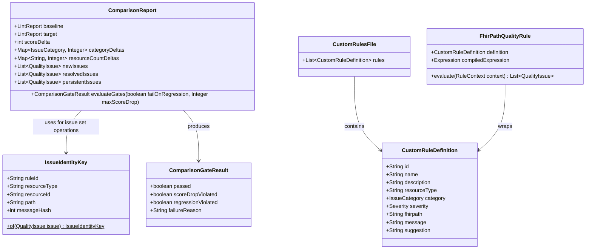

# Data Model: Phase 8 — Advanced Extensibility, Dataset Comparison, and Dynamic FHIRPath Rules

**Branch**: `008-advanced-extensibility-diffing` | **Date**: 2026-10-03 | **Spec**: [spec.md](spec.md)

---

## 1. Domain Entities & Value Objects

---

## 2. Entity Specifications

### 2.1 `IssueIdentityKey`
- **Package**: `org.fhirlint.core.comparison`
- **Type**: Immutable Java Record
- **Fields**:
  - `String ruleId`: The defect rule identifier (e.g. `REF-001`, `CUSTOM-BP-001`). Must not be null.
  - `String resourceType`: Target resource type (e.g. `Observation`, `Patient`). Defaults to `"__GLOBAL__"` if null.
  - `String resourceId`: Target resource logical ID. Defaults to `"__NO_ID__"` if null.
  - `String path`: FHIRPath location of the defect (e.g. `Observation.subject.reference`). Defaults to `"__ROOT__"` if null.
  - `int messageHash`: Hash of the defect message, evaluated only when `resourceId` is `"__NO_ID__"` to disambiguate un-identified resources.

### 2.2 `ComparisonReport`
- **Package**: `org.fhirlint.core.comparison`
- **Type**: Immutable Class / Record
- **Fields**:
  - `LintReport baseline`: Full lint report from the baseline dataset.
  - `LintReport target`: Full lint report from the target dataset.
  - `int scoreDelta`: $\text{targetScore} - \text{baselineScore}$. Positive values indicate quality improvement; negative values indicate regression.
  - `Map<QualityCategory, Integer> categoryDeltas`: Per-category score delta across all 6 quality categories.
  - `Map<String, Integer> resourceCountDeltas`: Count change per resource type (`targetCount - baselineCount`) plus `"TOTAL"`.
  - `List<QualityIssue> newIssues`: Issues present in target but absent in baseline.
  - `List<QualityIssue> resolvedIssues`: Issues present in baseline but absent in target.
  - `List<QualityIssue> persistentIssues`: Issues present in both baseline and target.

### 2.3 `ComparisonGateResult`
- **Package**: `org.fhirlint.core.comparison`
- **Type**: Immutable Record
- **Fields**:
  - `boolean passed`: `true` if all enabled quality gates passed; `false` if any gate failed.
  - `boolean scoreDropViolated`: `true` if score drop exceeded `--max-score-drop`.
  - `boolean regressionViolated`: `true` if `--fail-on-regression` was active and any new error-level issue or score drop occurred.
  - `String failureReason`: Human-readable summary of the gate breach (or empty string if passed).

### 2.4 `CustomRuleDefinition`
- **Package**: `org.fhirlint.core.rules.custom`
- **Type**: Java Record (with Jackson annotations for YAML deserialization)
- **Validation Rules**:
  - `id`: Required, non-empty, alphanumeric and hyphens (`^[a-zA-Z0-9_-]+$`).
  - `name`: Required, non-empty string.
  - `category`: Required enum value matching `structural`, `profileConformance`, `referentialIntegrity`, `consistency`, `terminology`, `completeness`.
  - `severity`: Required enum value matching `error`, `warning`, `info`.
  - `fhirpath`: Required, non-empty invariant expression string.
  - `message`: Required, non-empty error message emitted when `fhirpath` evaluates to false.
  - `suggestion`: Optional remediation hint.
  - `resourceType`: Optional target resource filter (e.g. `Observation`). If omitted, rule evaluates across all resources in the index.

### 2.5 `FhirPathQualityRule`
- **Package**: `org.fhirlint.core.rules.custom`
- **Type**: Class implementing `org.fhirlint.core.rules.QualityRule`
- **Responsibilities**:
  - Wraps a validated `CustomRuleDefinition`.
  - Holds a pre-compiled AST expression parsed via `FHIRPathEngine`.
  - During `execute(ResourceGraphIndex index)`:
    - Filters indexed resources by `resourceType` (or takes all resources if empty).
    - Calls `fhirPathEngine.evaluateToBoolean(resource, compiledExpression)`.
    - If false, constructs and emits a `QualityIssue`.
