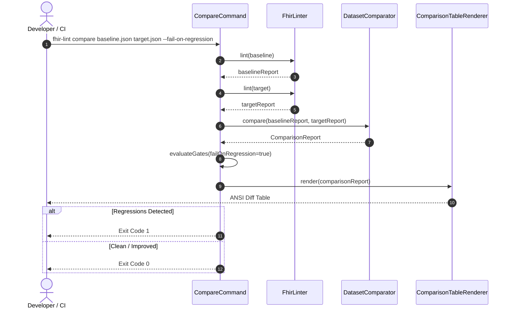

# Implementation Plan: Phase 8 — Advanced Extensibility, Dataset Comparison, and Dynamic FHIRPath Rules

**Branch**: `008-advanced-extensibility-diffing` | **Date**: 2026-10-03 | **Spec**: [spec.md](spec.md)

**Input**: Feature specification from `specs/008-advanced-extensibility-diffing/spec.md`

---

## Summary

Deliver Phase 8 capabilities for FHIRLint:
1. **Dataset Comparison & Regression Diffing**: Pure in-memory Java core service (`DatasetComparator`) and CLI command (`fhir-lint compare <baseline> <target>`) to track $\Delta \text{score}$, category score shifts, resource count deltas, new vs. resolved defects, and CI/CD quality gate enforcement (`--fail-on-regression`, `--max-score-drop`).
2. **Dynamic Custom Rules via YAML & FHIRPath**: In-memory rule definition loader (`--rules <path>`) parsing YAML specifications into pre-compiled HAPI FHIRPath invariants (`FhirPathQualityRule`), executing seamlessly alongside compiled core rules with zero infrastructure dependencies.
3. **Enterprise Ergonomics**: Colorized ANSI differential table output, structured machine-readable JSON diffs, sequential dataset processing for bounded memory safety, and full GraalVM native image reachability metadata.

---

## Technical Context

**Language/Version**: Java 21+

**Primary Dependencies**:
- HAPI FHIR R4 6.10.0 (`hapi-fhir-base`, `hapi-fhir-structures-r4`, `hapi-fhir-validation`, `FHIRPathEngine`)
- Picocli 4.7.6 (CLI parsing, subcommands, exit code handling)
- Jackson 2.18.2 (`jackson-databind`, `jackson-datatype-jsr310`, `jackson-dataformat-yaml`)
- SLF4J 2.0.16 + Logback 1.5.16

**Storage**: None (Strictly stateless in-memory execution; zero databases, zero disk caching, zero PHI retention)

**Testing**: JUnit 5 (5.11.4), AssertJ (3.27.3)

**Target Platform**: Cross-platform Linux / macOS / Windows (JVM 21+ and GraalVM AOT native binaries)

**Project Type**: Standalone CLI tool and embeddable pure Java library (`fhir-lint-core`)

**Performance Goals**:
- Sub-1s dynamic FHIRPath evaluation of 1,000 resources against 10 custom rules (NFR-002)
- Total test suite execution under 3.5 seconds

**Constraints**:
- Standard POSIX exit codes: `0` (pass), `1` (gate breach / regression), `2` (parameter/syntax error)
- Sequential evaluation of baseline and target datasets to prevent JVM heap exhaustion on large 20,000+ resource bundles
- Strict zero-retention compliance (Constitution Principle V)

---

## Constitution Check

*GATE: Must pass before Phase 0 research. Re-checked after Phase 1 design.*

| Principle | Status | Evaluation |
| :--- | :---: | :--- |
| **I. Standards-First Healthcare Interoperability** | PASS | Custom rules use official HL7 FHIRPath invariant syntax evaluated via reference HAPI FHIR engine. |
| **II. Lean, Dependency-Minimized Architecture** | PASS | Adds only `jackson-dataformat-yaml` (same version as existing Jackson stack) to support human-authored YAML rules. Core diffing is 100% pure Java. |
| **III. Testable and Reliable Software** | PASS | All new features are covered by fast unit tests for `DatasetComparator`, `IssueIdentityKey`, `FhirPathQualityRule`, and end-to-end Picocli subcommand tests. |
| **IV. Actionable Data-Quality Analysis** | PASS | Comparison outputs show clear deltas, exact new vs resolved issues with resource IDs and paths. Custom rules support `suggestion` field. |
| **V. Privacy-Conscious Healthcare Software** | PASS | Strictly in-memory transient execution. Zero disk persistence, zero database, zero network egress. |
| **VI. Incremental Development and Simplicity** | PASS | Builds cleanly on top of existing `LintReport`, `QualityRule`, and Picocli architecture without modifying Phase 1–7 scoring formulas. |
| **VII. Developer-Focused CLI & Library Design** | PASS | Both CLI (`fhir-lint compare`) and programmatic Java library API (`DatasetComparator`) are first-class citizens. |

---

## Project Structure

### Documentation (this feature)

```text
specs/008-advanced-extensibility-diffing/
├── spec.md              # Requirements and user scenarios
├── plan.md              # This architecture plan
├── research.md          # Technical decisions and justifications
├── data-model.md        # Domain entities and value objects
├── quickstart.md        # End-to-end integration and verification guide
└── contracts/           # CLI, YAML schema, and Java API contracts
    ├── cli-compare-contract.md
    ├── custom-rules-schema.md
    └── java-api-contract.md
```

### Source Code Additions

```text
fhir-lint/
├── build.gradle                                            # Add jackson-dataformat-yaml:2.18.2
├── src/main/java/org/fhirlint/
│   ├── core/
│   │   ├── comparison/                                     # Core comparison engine
│   │   │   ├── IssueIdentityKey.java                       # Canonical issue tuple
│   │   │   ├── ComparisonReport.java                       # Immutable diff report
│   │   │   ├── ComparisonGateResult.java                   # Regression gate outcomes
│   │   │   └── DatasetComparator.java                      # In-memory diff service
│   │   └── rules/custom/                                   # Dynamic YAML FHIRPath rules
│   │       ├── CustomRuleDefinition.java                   # YAML rule POJO/Record
│   │       ├── CustomRulesFile.java                        # Root YAML container
│   │       ├── CustomRuleLoader.java                       # YAML parser & AST compiler
│   │       └── FhirPathQualityRule.java                    # QualityRule adapter
│   └── cli/
│       ├── FhirLintApplication.java                        # Register compare subcommand
│       ├── command/
│       │   ├── ValidateCommand.java                        # Add --rules option
│       │   └── CompareCommand.java                         # fhir-lint compare implementation
│       └── renderer/
│           ├── ComparisonTableRenderer.java                # ANSI diff table renderer
│           └── ComparisonJsonRenderer.java                 # Structured JSON diff renderer
└── src/test/java/org/fhirlint/
    ├── core/
    │   ├── comparison/
    │   │   ├── IssueIdentityKeyTest.java
    │   │   └── DatasetComparatorTest.java
    │   └── rules/custom/
    │       ├── CustomRuleLoaderTest.java
    │       └── FhirPathQualityRuleTest.java
    └── cli/
        ├── CompareCommandTest.java
        └── CustomRulesCliTest.java
```

---

## Architecture & Data Flow



---

## Implementation Phases

### Phase 1: Core Comparison Engine (`org.fhirlint.core.comparison`)
- Implement `IssueIdentityKey` record with deterministic hash fallback.
- Implement `ComparisonReport` and `ComparisonGateResult`.
- Implement `DatasetComparator.compare(...)`.
- Unit tests: identical datasets, regressions, resolved issues, empty datasets, score deltas.

### Phase 2: Dynamic Custom FHIRPath Rules (`org.fhirlint.core.rules.custom`)
- Add `jackson-dataformat-yaml:2.18.2` to `build.gradle`.
- Implement `CustomRuleDefinition` and `CustomRulesFile` records.
- Implement `CustomRuleLoader` with FHIRPath AST pre-compilation via HAPI `FhirPathR4`.
- Implement `FhirPathQualityRule` adapter for `QualityRule`.
- Integrate custom rules into `FhirLinter` and rule registry.
- Unit tests: valid rules, malformed YAML, invalid FHIRPath, invariant execution.

### Phase 3: CLI Subcommand & Renderers (`org.fhirlint.cli`)
- Implement `ComparisonTableRenderer` (ANSI colorized summary, category deltas, new vs resolved).
- Implement `ComparisonJsonRenderer` (matching JSON contract).
- Implement `CompareCommand` in Picocli with options (`--profile`, `--format`, `--output`, `--fail-on-regression`, `--max-score-drop`, `--rules`, `-v`).
- Wire `CompareCommand` into `FhirLintApplication`.
- Update `ValidateCommand` to accept `--rules <path>`.
- CLI integration tests: exit codes 0, 1, 2, stdout/stderr streams, file redirection.

### Phase 4: GraalVM Native Image Reachability & Verification
- Update `reflect-config.json` and `resource-config.json` for Jackson YAML and SnakeYAML.
- Verify native image compilation and verify native executable with `compare` and `--rules`.
- Run comprehensive check (`./gradlew check`).
