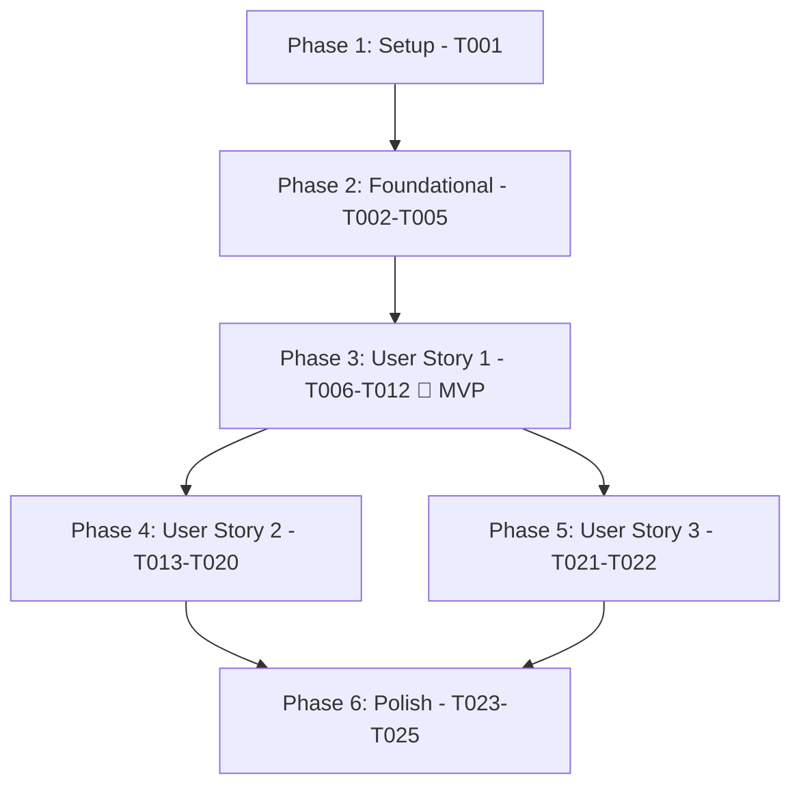

# Tasks: Phase 8 — Advanced Extensibility, Dataset Comparison, and Dynamic FHIRPath Rules

**Input**: Design documents from `/specs/008-advanced-extensibility-diffing/`
**Prerequisites**: [plan.md](plan.md), [spec.md](spec.md), [data-model.md](data-model.md), [contracts/](contracts/), [research.md](research.md), [quickstart.md](quickstart.md)

---

## Phase 1: Setup (Shared Dependencies)

**Purpose**: Dependency configuration and build tooling updates

- [X] T001 Add `com.fasterxml.jackson.dataformat:jackson-dataformat-yaml:2.18.2` dependency to `build.gradle`

---

## Phase 2: Foundational (Blocking Prerequisites)

**Purpose**: Core comparison data models and issue identity key required for all comparison features

**⚠️ CRITICAL**: No user story work can begin until this foundational phase is complete

- [X] T002 [P] Implement `IssueIdentityKey` record with deterministic hash fallback in `src/main/java/org/fhirlint/core/comparison/IssueIdentityKey.java`
- [X] T003 [P] Implement unit tests for `IssueIdentityKey` in `src/test/java/org/fhirlint/core/comparison/IssueIdentityKeyTest.java`
- [X] T004 [P] Implement `ComparisonGateResult` record in `src/main/java/org/fhirlint/core/comparison/ComparisonGateResult.java`
- [X] T005 [P] Implement `ComparisonReport` immutable model in `src/main/java/org/fhirlint/core/comparison/ComparisonReport.java`

**Checkpoint**: Foundational models complete. User story implementation can begin.

---

## Phase 3: User Story 1 - Dataset Comparison & Quality Regression Diffing (Priority: P1) 🎯 MVP

**Goal**: Enable in-memory and CLI comparison of two FHIR datasets (`fhir-lint compare <baseline> <target>`), tracking score deltas, new vs. resolved defects, and enforcing regression gates (`--fail-on-regression`, `--max-score-drop`).

**Independent Test**: Execute `fhir-lint compare sample-data/clean/clean-bundle.json sample-data/messy/messy-bundle.json` and verify colorized ANSI diff output, $\Delta \text{score}$, gate enforcement, and exit codes (0 on pass, 1 on regression breach).

### Tests for User Story 1
- [X] T006 [P] [US1] Create unit tests in `src/test/java/org/fhirlint/core/comparison/DatasetComparatorTest.java` covering identical datasets, score drops, new error regressions, resolved issues, and empty datasets

### Implementation for User Story 1
- [X] T007 [US1] Implement `DatasetComparator.compare(LintReport baseline, LintReport target)` in `src/main/java/org/fhirlint/core/comparison/DatasetComparator.java` (depends on T002, T004, T005)
- [X] T008 [P] [US1] Implement `ComparisonTableRenderer` rendering colorized ANSI differential report with score delta, category shifts, resource deltas, new vs resolved issues in `src/main/java/org/fhirlint/cli/renderer/ComparisonTableRenderer.java`
- [X] T009 [P] [US1] Implement `ComparisonJsonRenderer` outputting structured JSON diff matching `contracts/cli-compare-contract.md` in `src/main/java/org/fhirlint/cli/renderer/ComparisonJsonRenderer.java`
- [X] T010 [US1] Implement `CompareCommand` in `src/main/java/org/fhirlint/cli/command/CompareCommand.java` with options (`--profile`, `--format`, `-o/--output`, `--fail-on-regression`, `--max-score-drop`, `-v/--verbose`)
- [X] T011 [US1] Register `CompareCommand` as a subcommand on `FhirLintApplication` in `src/main/java/org/fhirlint/cli/FhirLintApplication.java`
- [X] T012 [US1] Implement CLI end-to-end integration tests in `src/test/java/org/fhirlint/cli/CompareCommandTest.java` verifying exit codes (`0`, `1`, `2`), output formats (`table`, `json`), and stream separation

**Checkpoint**: User Story 1 complete! Standalone dataset comparison and CI/CD regression gates are fully functional.

---

## Phase 4: User Story 2 - Dynamic User-Defined Rules via YAML & FHIRPath (Priority: P2)

**Goal**: Allow developers and clinical teams to pass custom YAML files (`--rules <path>`) containing FHIRPath invariants evaluated dynamically in-memory with HAPI FHIR, reporting custom defects and decrementing category quality scores.

**Independent Test**: Define a custom rule in a YAML file, execute `fhir-lint validate <dataset> --rules custom-rules.yaml`, and verify custom defect emission, location context, and penalty scoring.

### Tests for User Story 2
- [X] T013 [P] [US2] Implement unit tests for custom rule YAML loading and validation in `src/test/java/org/fhirlint/core/rules/custom/CustomRuleLoaderTest.java`
- [X] T014 [P] [US2] Implement unit tests for `FhirPathQualityRuleTest` in `src/test/java/org/fhirlint/core/rules/custom/FhirPathQualityRuleTest.java`

### Implementation for User Story 2
- [X] T015 [P] [US2] Implement `CustomRuleDefinition` and `CustomRulesFile` records in `src/main/java/org/fhirlint/core/rules/custom/CustomRuleDefinition.java` and `CustomRulesFile.java`
- [X] T016 [US2] Implement `CustomRuleLoader` in `src/main/java/org/fhirlint/core/rules/custom/CustomRuleLoader.java` parsing YAML, validating fields, and pre-compiling FHIRPath invariants via HAPI's `FhirPathR4`
- [X] T017 [US2] Implement `FhirPathQualityRule` adapter for `QualityRule` in `src/main/java/org/fhirlint/core/rules/custom/FhirPathQualityRule.java`
- [X] T018 [US2] Update `FhirLinter` and builder in `src/main/java/org/fhirlint/core/FhirLinter.java` to accept custom rules and register them into the rule execution pipeline
- [X] T019 [US2] Update `ValidateCommand` and `CompareCommand` to accept `--rules <path>` option (single file, comma-separated list, or directory)
- [X] T020 [US2] Implement integration tests in `src/test/java/org/fhirlint/cli/CustomRulesCliTest.java` verifying custom rule execution, syntax errors (exit code 2), and score reduction

**Checkpoint**: User Story 2 complete! Custom YAML FHIRPath rules are fully functional across both `validate` and `compare`.

---

## Phase 5: User Story 3 - Dataset Comparison Directory & Multi-File Support (Priority: P3)

**Goal**: Support comparing directories containing multiple FHIR files (`fhir-lint compare ./v1/ ./v2/`), recursively aggregating resources into baseline and target inventories.

**Independent Test**: Execute `fhir-lint compare dirA/ dirB/` with multiple files in each directory and verify complete aggregated diffing.

### Implementation for User Story 3
- [X] T021 [US3] Update `CompareCommand` in `src/main/java/org/fhirlint/cli/command/CompareCommand.java` to support directory input sources, aggregating multiple files per directory
- [X] T022 [US3] Implement integration tests in `src/test/java/org/fhirlint/cli/CompareDirectoryTest.java` verifying multi-file batch comparisons and missing directory error handling (exit code 2)

**Checkpoint**: User Story 3 complete! Batch directory comparison operational.

---

## Phase 6: Polish & Cross-Cutting Concerns

**Purpose**: Native image metadata, documentation, and regression verification

- [X] T023 [P] Update GraalVM reachability metadata (`reflect-config.json` and `resource-config.json`) for Jackson YAML, SnakeYAML, and custom rule records
- [X] T024 [P] Update `README.md` and CLI documentation with `fhir-lint compare` usage, examples, and custom YAML rule authoring guide
- [X] T025 Execute comprehensive check `./gradlew check` and verify 100% test pass rate in sub-3.5 seconds

---

## Dependencies & Execution Order

### Parallel Execution Opportunities
- **Foundational**: T002, T003, T004, T005 can all proceed in parallel across independent files.
- **User Story 1**: T008 (`ComparisonTableRenderer`) and T009 (`ComparisonJsonRenderer`) can be developed in parallel once T007 (`DatasetComparator`) is implemented.
- **User Story 2**: T013, T014, T015 can proceed in parallel with US1 CLI wiring.
- **Polish**: T023 (`reflect-config.json`) and T024 (`README.md`) can proceed in parallel.
